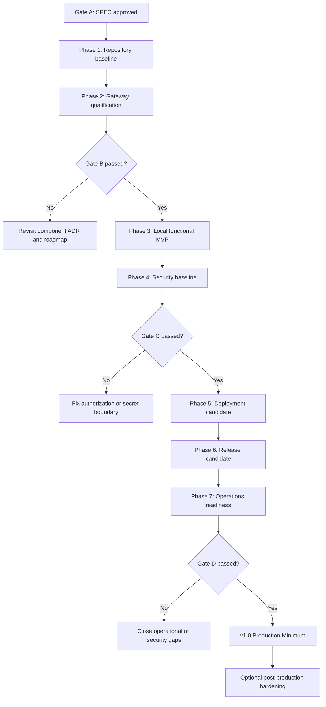

# SMTP-шлюз до Microsoft Graph: технічний roadmap

**Статус:** план імплементації
**Джерело вимог:** `docs/SPEC.md`
**Стратегія:** MVP First → Production Minimum First
**Останнє оновлення:** 2026-07-22

> Цей документ призначений для поетапної AI-assisted implementation. Він не є підтвердженням того, що описані компоненти вже реалізовані або перевірені. Фактичний стан фіксується у `docs/AI_CONTEXT.md`, а результати рішень — в ADR.

# 0. Phase Map and Transition Rules

## Послідовність фаз

| Фаза | Призначення | Очікуваний результат | Умова переходу |
|---|---|---|---|
| [Phase 1](#phase-1--repository-tooling-and-local-development-baseline) | Repository, tooling та local development baseline | `v0.1`: безпечна структура, контекст, contract і локальні checks | Phase 1 Quality Gate пройдений; configuration contract reviewed |
| [Phase 2](#phase-2--core-architecture-and-gateway-qualification) | Core architecture та gateway qualification | `v0.2`: evidence bundle і рішення Gate B | Gate B `pass` або `conditional pass` без Critical blocker |
| [Phase 3](#phase-3--core-functional-implementation) | Local functional MVP | `v0.3`: відтворюваний non-production SMTP-to-Graph skeleton | Phase 3 Quality Gate пройдений; локальні negative/restart тести зелені |
| [Phase 4](#phase-4--authentication-authorization-and-security-baseline) | Authentication, authorization і security baseline | `v0.4`: Gate C evidence, TLS, secret boundary та hardening | Gate C пройдений на non-production evidence |
| [Phase 5](#phase-5--deployment-and-gitsecops) | Deployment та GitSecOps | `v0.5`: staging deployment candidate з rollback | staging deploy, no-op redeploy і rollback rehearsal успішні |
| [Phase 6](#phase-6--testing-stabilization-and-release-candidate) | Testing, stabilization та release candidate | `v0.6`: функціональне/security/failure/recovery evidence | усі Must-тести зелені; Critical/High findings закриті або formally excepted |
| [Phase 7](#phase-7--observability-backup-restore-and-operations) | Observability, backup/restore та operations | `v0.7`: runbooks, game day і Gate D evidence | Gate D пройдений; cold recovery вкладається у RTO 60 хвилин |
| [Phase 8](#phase-8--optional-post-production-hardening) | Optional post-production hardening | контрольовані покращення після `v1.0` | окремий business/security trigger і approved scope; фаза не є передумовою `v1.0` |

## Переходи між фазами

Основний послідовний шлях:

`Gate A → Phase 1 → Phase 1 Quality Gate → Phase 2 → Gate B → Phase 3 → Phase 4 → Gate C → Phase 5 → Phase 6 → Phase 7 → Gate D → v1.0 → Phase 8 (optional)`

- Невдалий Phase 1 Quality Gate повертає роботу в Phase 1; production implementation не починається.
- Gate B `reject` повертає рішення до ADR/roadmap review і блокує Phase 3; `conditional pass` дозволяє Phase 3 лише без Critical gaps.
- Невдалий Gate C повертає роботу до Phase 4 security boundary; Phase 5 production-capable deployment не дозволяється.
- Невдалий Gate D повертає роботу до Phase 7 operations/recovery; `v1.0` не оголошується.
- Phase 8 запускається лише після `v1.0` за окремим approved trigger і не змінює попередні acceptance gates.

---

# 1. Roadmap Overview

## Призначення

Roadmap перетворює погоджені вимоги `docs/SPEC.md` на малі, технічно виконувані й придатні до рев’ю ітерації. Кожна задача має визначені залежності, файли, критерії приймання, перевірки, ризики та спосіб безпечного відкату.

## Стратегія імплементації

1. Зафіксувати чистий repository baseline і компактний контекст для AI-агентів.
2. До production-імплементації експериментально кваліфікувати pinned SMTP2Graph release та закрити Gate B.
3. Побудувати мінімальний локальний end-to-end skeleton без production credentials.
4. Додати production security boundary: Entra/Exchange authorization, TLS, client policy та runtime secrets.
5. Створити відтворюваний single-node Docker Swarm deployment і захищений CI/CD.
6. Провести системні, failure, security та recovery тести й сформувати release candidate.
7. Додати мінімальну observability та операційні процедури перед `v1.0`.
8. Відкласти HA, UI, self-service та іншу необов’язкову складність до появи виміряної потреби.

## Цільовий production minimum

- Один SMTP2Graph service у single-node Docker Swarm з pinned image digest.
- Одна dedicated sender mailbox `noreply@ldubgd.edu.ua`.
- Application-only Microsoft Graph access, обмежений mailbox scope через Exchange Online RBAC for Applications.
- SMTP endpoint лише у внутрішній мережі; TLS обов’язковий для Moodle та для будь-якого routed traffic.
- Для Swarm-клієнтів plaintext SMTP допустимий лише в overlay-мережі, створеній з `--opt encrypted`.
- Окремі SMTP credentials, IP/subnet allowlist, exact `From` allowlist, ліміти розміру, частоти й сесій.
- Durable bounded queue, контрольований retry/dead-letter lifecycle та видалення failed payloads не пізніше 7 днів.
- Docker Secrets у `/run/secrets/`; plaintext production secrets відсутні у Git, environment, image, CI artifacts і logs.
- Відтворювані deploy, rollback і cold recovery з RTO 60 хвилин.
- Незалежні health/synthetic checks, VictoriaMetrics + Grafana та незалежний канал сповіщень.

## Очікуваний release path

`v0.1` repository baseline → `v0.2` qualified gateway → `v0.3` local functional MVP → `v0.4` security baseline → `v0.5` deployment candidate → `v0.6` release candidate → `v0.7` operational readiness → `v1.0` production minimum.

## Ключові обмеження

- `docs/SPEC.md` є джерелом істини; roadmap не може мовчки змінювати scope або security baseline.
- Production code не створюється під час підготовки цього roadmap.
- Наявні `.github/workflows/main.yml` і `scripts/deploy-orchestrator-swarm.sh` походять із Koha-шаблону та не вважаються валідною реалізацією SMTP2Graph.
- Без database, external broker, Kubernetes, service mesh, active-active HA або web UI у production minimum.
- Жодних реальних secrets чи чутливих MIME-прикладів у repository fixtures.
- Production зміни виконуються лише через reviewed IaC/automation та protected environment approval.
- Gate B блокує остаточний вибір SMTP2Graph; Gate C блокує production authorization; Gate D блокує `v1.0`.

## Керування змінами специфікації

- Конфлікт між roadmap і SPEC вирішується на користь SPEC.
- Нова вимога спочатку вноситься до SPEC, потім — до roadmap і, якщо рішення довготривале, до ADR.
- Якщо SMTP2Graph не проходить Gate B, реалізація зупиняється на decision point; fallback обирається окремим ADR, а roadmap переглядається.

---

# 2. Release Strategy

## v0.1 — Repository and AI Context Baseline

- **Goal:** зробити repository безпечним і однозначним для подальшої реалізації.
- **Included capabilities:** inventory наявних шаблонів; базова структура; lint/format policy; `.env.example`; `README.md`; `docs/AI_CONTEXT.md`; changelog policy.
- **Excluded capabilities:** gateway runtime, реальні credentials, deployment.
- **Exit criteria:** Koha-specific assets явно класифіковані; repository checks працюють локально; AI_CONTEXT посилається на SPEC і roadmap.

## v0.2 — Qualified SMTP2Graph Candidate

- **Goal:** закрити Gate B до інвестування у production deployment.
- **Included capabilities:** pinned version/digest; provenance, SBOM і scan; secret-file/certificate compatibility; non-root/read-only; MIME, queue та acknowledgement probes; ADR-0001…0003.
- **Excluded capabilities:** production tenant, production mailbox, SLA.
- **Exit criteria:** Gate B має evidence bundle і рішення `pass`, `conditional pass` або `reject`; `reject` не дозволяє переходити до реалізації SMTP2Graph.

## v0.3 — Local Functional MVP

- **Goal:** отримати локальний, неproduction end-to-end skeleton основного SMTP-to-Graph flow.
- **Included capabilities:** declarative non-secret config; tmpfs runtime config wrapper; local SMTP policy; persistent queue; safe fixtures; smoke test harness.
- **Excluded capabilities:** production secret material, production deploy, повний monitoring.
- **Exit criteria:** дозволене тестове повідомлення проходить flow; негативні auth/sender/size тести та restart queue test відтворювані.

## v0.4 — Authentication, Authorization and Security Baseline

- **Goal:** реалізувати least-privilege identity й network boundary.
- **Included capabilities:** non-production Entra application; Exchange RBAC mailbox scope; TLS; per-client credentials; SOPS + age policy; container hardening; security scans.
- **Excluded capabilities:** production activation, advanced threat model.
- **Exit criteria:** Gate C пройдено на non-production evidence; out-of-scope mailbox send заборонено; secrets не витікають у визначені surfaces.

## v0.5 — Swarm Deployment Candidate

- **Goal:** отримати відтворюваний staging deployment candidate.
- **Included capabilities:** Swarm stack; encrypted overlay; versioned Docker Secrets; idempotent scripts; secure CI/CD; staging deploy/rollback.
- **Excluded capabilities:** production traffic і production credentials.
- **Exit criteria:** чистий staging host може бути розгорнутий, повторно reconciled і відкочений лише automation-засобами.

## v0.6 — Tested Release Candidate

- **Goal:** підтвердити функціональні, security, failure та recovery вимоги.
- **Included capabilities:** integration/acceptance/security/regression tests; п’ять client profiles; burst test; release evidence.
- **Excluded capabilities:** production cutover.
- **Exit criteria:** усі Must-тести зелені; відсутні Critical/High unresolved findings або є письмово погоджений exception із строком.

## v0.7 — Operations Ready

- **Goal:** забезпечити виявлення збоїв і відновлення в межах SLO/RTO.
- **Included capabilities:** health, structured logs, correlation IDs, minimal metrics, VictoriaMetrics/Grafana, alerts, synthetic delivery, backup/restore/rollback runbooks.
- **Excluded capabilities:** active-active HA, довгостроковий mail archive.
- **Exit criteria:** оператор проходить game day; cold recovery вкладається у 60 хвилин; alert надходить незалежним каналом.

## v1.0 — Production Minimum Release

- **Goal:** безпечно підключити production-клієнтів поетапно.
- **Included capabilities:** Gate D; protected production deployment; canary onboarding; Grafana/DSpace/Koha/Matomo, потім Moodle після burst validation.
- **Excluded capabilities:** окремі mailbox для кожного клієнта, HA, UI, self-service, external broker/database.
- **Exit criteria:** production checklist підписаний owners; synthetic та реальна контрольована доставка успішні; rollback готовий; 7-денне посилене спостереження не виявило blocker.

---

# 3. MoSCoW Prioritization

## Must Have

- Кваліфікація та digest pinning SMTP2Graph.
- SMTP ingress на internal interface; TLS для routed traffic.
- Encrypted Swarm overlay як умова plaintext SMTP усередині Swarm.
- SMTP AUTH, окремі client credentials, IP/subnet та exact sender allowlists.
- Ліміти: 25 MiB, до 5 concurrent sessions/IP, до 30 messages/min/client; окреме throttle рішення для Moodle.
- Application-only Graph auth і доведене mailbox-level restriction.
- Safe runtime config із secrets у `/run/secrets/`, SOPS + age та versioned Docker Secrets.
- Persistent bounded queue, коректні 4xx/5xx, restart/retry/dead-letter semantics.
- Failed payload retention ≤ 7 днів, `/data/failed` mode `0700`, відсутність `/data/failed` у планових backups.
- Non-root container або formal blocker/exception до Gate D; no privileged/socket/host networking.
- Secure CI/CD, protected production approval, secret/dependency/image/IaC scans і SBOM.
- Integration, security, failure, rollback і cold recovery tests.
- Structured privacy-safe logs, health, queue/disk/expiry/failure monitoring і independent synthetic alert.
- `README.md`, `docs/AI_CONTEXT.md`, ADR, test plan, runbook, client onboarding і script runbook у відповідні фази.

## Should Have

- Certificate-based Graph credential, якщо pinned release підтримує file-based certificate auth без unsafe wrapper.
- Read-only root filesystem, dropped capabilities, `no-new-privileges` і resource limits.
- Signature/provenance verification upstream image, якщо доступна.
- Non-production recipient allowlist.
- Pre-commit secret scan та локальні policy checks.
- Automated purge job для failed payloads із перевіркою retention.
- Canary onboarding малонавантажених клієнтів перед Moodle.

## Could Have

- Formal `docs/SECURITY_MODEL.md`/STRIDE після MVP, якщо Gate D review не вимагає раніше.
- Prometheus-compatible exporter, якщо наявних сигналів недостатньо.
- Image rebuild from source за policy requirement.
- Автоматизовані expiry reminders і частково автоматизована rotation.
- Active-passive standby після виміряної потреби.

## Won’t Have Now

- Active-active cluster, Kubernetes, service mesh.
- Web administration UI і self-service onboarding.
- General-purpose MTA, inbound mailbox, marketing/bulk campaigns.
- Окрема database або зовнішній message broker.
- Окремий Graph application/mailbox для кожного клієнта.
- Backup або довгострокове архівування live queue/failed message content.
- Власний gateway, якщо SMTP2Graph проходить Gate B.

---

# 4. Definition of Ready

Implementation task готова до виконання, лише якщо:

- [ ] Expected behavior та межі задачі зрозумілі.
- [ ] Inputs, outputs, error behavior і durability boundary визначені.
- [ ] Affected files/modules та owner/reviewer roles ідентифіковані.
- [ ] Acceptance criteria й local verification method визначені.
- [ ] Необхідні env variables та secret names відомі; реальні значення не потрібні в Git.
- [ ] Security/privacy impact класифікований.
- [ ] Немає невирішених Critical Questions, що блокують задачу.
- [ ] Необхідні ADR прийняті або створення ADR є першим кроком задачі.
- [ ] Залежний зовнішній доступ, test tenant/mailbox або fixture доступні.
- [ ] Rollback/recovery підхід визначений для state, deployment і credential changes.
- [ ] Команди перевірки не містять production secrets і мають визначене безпечне середовище виконання.

---

# 5. Definition of Done

## Для кожної великої задачі

- [ ] Мінімальна реалізація відповідає acceptance criteria без розширення scope.
- [ ] Lint, format, type/schema checks і релевантні tests виконані та зафіксовані.
- [ ] Негативні й failure cases перевірені, якщо задача змінює security або delivery flow.
- [ ] Документація оновлена лише там, де змінилися contract, architecture, operations, security або AI context.
- [ ] Secrets, tokens, MIME bodies і sensitive headers відсутні у Git, logs, fixtures та artifacts.
- [ ] Немає unresolved blocking assumptions; accepted risk має owner, строк і посилання на рішення.
- [ ] Rollback/recovery notes перевірені там, де це релевантно.
- [ ] Git diff не містить сторонніх або випадкових змін.

## Для кожної фази

- [ ] Усі Must-задачі фази завершені або формально заблоковані decision gate.
- [ ] Phase quality gate пройдено.
- [ ] Deliverables доступні для незалежного review.
- [ ] `docs/AI_CONTEXT.md` оновлено, якщо змінився фактичний стан, stack або accepted ADR.
- [ ] Changelog доповнений наприкінці активного файла, якщо фаза створила user/operator-visible change.

## Для v1.0

- [ ] Gate B, C і D пройдені з evidence.
- [ ] Усі production-minimum acceptance criteria зі SPEC перевірені.
- [ ] Backup/restore, rollback, credential revocation і cold recovery виконані практично.
- [ ] RTO 60 хвилин підтверджено; RPO assumptions задокументовані.
- [ ] Production owner, M365 owner, security reviewer і client owners надали sign-off.

---

# 6. Implementation Phases

## Phase 1 — Repository, Tooling and Local Development Baseline

**Objective:** створити чистий, безпечний і зрозумілий skeleton без production runtime.
**Dependencies:** погоджений `docs/SPEC.md`; цей roadmap.
**Deliverables:** repository policy, базові checks, документаційна точка входу, AI context.
**Phase risks:** випадкове виконання Koha-template; передчасне закріплення неперевіреного stack.
**Phase rollback:** кожна зміна документації/tooling відкочується окремим commit; user changes у SPEC не перезаписуються.

### Task 1.1 — Inventory та quarantine початкових шаблонів

- **Priority:** Must
- **Goal:** відокремити корисні patterns від Koha-specific і небезпечних припущень.
- **Depends on:** немає.
- **Definition of Ready:** відомий повний file inventory; зафіксований clean/dirty Git state.
- **Implementation Steps:**
  1. Проаналізувати `.github/workflows/main.yml`, `scripts/deploy-orchestrator-swarm.sh`, `docs/hello-world.md` та всі приховані project files.
  2. Скласти таблицю `keep/adapt/replace/remove` з причинами.
  3. До заміни заблокувати deploy workflow від випадкового SMTP2Graph production use.
- **Files / Directories:** `.github/`, `scripts/`, `docs/hello-world.md`, `.gitignore`.
- **Artifacts:** inventory у PR description або `docs/AI_CONTEXT.md`; окремий ADR не потрібний.
- **Acceptance Criteria:** жодне Koha-specific значення не класифіковане як готове для gateway; deployment не запускається випадково.
- **Validation Commands:**
  ```bash
  rg -n 'koha|mariadb|VOL_DB|use_ansible' .github scripts docs
  git status --short
  ```
- **Risks:** видалення корисного shared-workflow pattern; приховані залежності.
- **Rollback Notes:** спочатку disable/rename references; фізичне видалення лише окремим reviewed commit.

### Task 1.2 — Repository structure та local quality tooling

- **Priority:** Must
- **Goal:** створити мінімальні каталоги й відтворювані lint/format/schema checks.
- **Depends on:** Task 1.1.
- **Definition of Ready:** обрані інструменти доступні локально/в CI; їхні версії можна pin.
- **Implementation Steps:**
  1. Створити лише потрібні `deploy/`, `tests/`, `scripts/lib/`, `docs/adr/` каталоги разом із першими реальними файлами.
  2. Додати Markdown, YAML, ShellCheck/shfmt та secret-scan configuration.
  3. Додати єдину idempotent validation entry point, наприклад `make validate`, без production side effects.
- **Files / Directories:** `Makefile`, `.editorconfig`, `.gitignore`, `.yamllint.yml`, `.markdownlint.*`, `.pre-commit-config.yaml`, `deploy/`, `tests/`.
- **Artifacts:** `README.md` із prerequisites і safe local commands.
- **Acceptance Criteria:** одна команда запускає статичні checks; versions pinned; validation не читає secret env files.
- **Validation Commands:**
  ```bash
  make validate
  git diff --check
  ```
- **Risks:** надлишкова кількість інструментів; platform-specific behavior.
- **Rollback Notes:** кожен tool додається окремо; залишити документовану manual command fallback.

### Task 1.3 — Configuration contract і безпечний `.env.example`

- **Priority:** Must
- **Goal:** визначити імена non-secret і secret inputs без реальних значень.
- **Depends on:** Task 1.2; попередній список вимог Gate B.
- **Definition of Ready:** зрозуміло, які inputs належать gateway, wrapper, Swarm і monitoring.
- **Implementation Steps:**
  1. Розділити public config, secret references та environment-specific values.
  2. Додати placeholders і comments; заборонити production `.env`.
  3. Створити machine-checkable список required keys без завантаження файла через `source`.
- **Files / Directories:** `.env.example`, `deploy/config/`, `scripts/verify-env.sh`.
- **Artifacts:** configuration section у `README.md`.
- **Acceptance Criteria:** приклад не містить credential-like values; missing/unknown keys детектуються; secret values не передаються через process arguments.
- **Validation Commands:**
  ```bash
  ./scripts/verify-env.sh --example-only
  gitleaks detect --no-banner --redact
  ```
- **Risks:** contract зміниться після Gate B.
- **Rollback Notes:** до Gate B contract позначений experimental; зміни ключів не обіцяють backward compatibility.

### Task 1.4 — AI context, changelog policy та documentation map

- **Priority:** Must
- **Goal:** дати maintainers і AI agents компактну актуальну точку входу.
- **Depends on:** Tasks 1.1–1.3.
- **Definition of Ready:** відомі фактичний status, accepted decisions і repository structure.
- **Implementation Steps:**
  1. Створити англомовний `docs/AI_CONTEXT.md` за структурою SPEC без дублювання документів.
  2. Створити `CHANGELOG.md` та активний append-only том у `docs/changelogs/`, якщо це підтверджує repository convention.
  3. Додати document precedence і update triggers.
- **Files / Directories:** `README.md`, `docs/AI_CONTEXT.md`, `CHANGELOG.md`, `docs/changelogs/`.
- **Artifacts:** documentation map.
- **Acceptance Criteria:** AI_CONTEXT не містить secrets; links валідні; changelog entries додаються лише в кінець активного тому.
- **Validation Commands:**
  ```bash
  markdownlint README.md CHANGELOG.md docs/*.md docs/changelogs/*.md
  rg -n 'SPEC.md|ROADMAP.md|AI_CONTEXT.md' README.md docs/AI_CONTEXT.md
  ```
- **Risks:** дублювання SPEC; churn після кожної малої задачі.
- **Rollback Notes:** видалити дубльований текст, зберігши links і фактичний status.

**Phase 1 Quality Gate**

- [ ] `make validate` проходить на чистому checkout.
- [ ] Secret scan не знаходить credential material.
- [ ] Koha-template не може виконати deployment.
- [ ] README, AI_CONTEXT і configuration contract reviewed.

## Phase 2 — Core Architecture and Gateway Qualification

**Objective:** закрити Gate B та зафіксувати незворотні рішення до production implementation.
**Dependencies:** Phase 1; test tenant/mailbox або безпечні mocks там, де можливо.
**Deliverables:** qualification evidence, accepted ADR, pinned candidate або documented rejection.
**Phase risks:** upstream capabilities не відповідають SPEC; test evidence залежить від зовнішнього tenant.
**Phase rollback:** не просувати rejected candidate; повернутися до architecture decision без production migration.

### Task 2.1 — ADR baseline та component decision

- **Priority:** Must
- **Goal:** формально зафіксувати базові architecture/security decisions.
- **Depends on:** Phase 1.
- **Definition of Ready:** alternatives і наслідки зі SPEC зрозумілі.
- **Implementation Steps:** створити ADR-0001…0007; ADR-0002 залишити Proposed до завершення qualification; пов’язати ADR із gates.
- **Files / Directories:** `docs/adr/ADR-0001-*.md` … `docs/adr/ADR-0007-*.md`.
- **Artifacts:** ADR index у `README.md`/AI_CONTEXT.
- **Acceptance Criteria:** кожен ADR має Context, Decision, Alternatives, Consequences і Status; `ADR-0007` описує cold recovery.
- **Validation Commands:**
  ```bash
  find docs/adr -type f -name 'ADR-*.md' -print | sort
  markdownlint docs/adr/*.md
  ```
- **Risks:** decision без evidence.
- **Rollback Notes:** Proposed ADR можна змінити; Accepted supersede-иться новим ADR, не переписується мовчки.

### Task 2.2 — Supply-chain qualification pinned release

- **Priority:** Must
- **Goal:** вибрати exact SMTP2Graph version/digest із перевіреним provenance.
- **Depends on:** Task 2.1.
- **Definition of Ready:** upstream source/image/release доступні; scan policy та severity threshold визначені.
- **Implementation Steps:** перевірити maintenance cadence, release notes, license, source-to-image provenance; отримати/створити SBOM; запустити vulnerability scan; зафіксувати digest.
- **Files / Directories:** `deploy/config/gateway-version.*`, `tests/acceptance/`, `.github/workflows/`.
- **Artifacts:** Gate B evidence, SBOM artifact policy, оновлений ADR-0002.
- **Acceptance Criteria:** немає unresolved Critical/High exploitability findings; mutable tag не використовується для deployment; digest відтворювано перевіряється.
- **Validation Commands:**
  ```bash
  docker pull "${GATEWAY_IMAGE_REF}"
  docker inspect --format '{{index .RepoDigests 0}}' "${GATEWAY_IMAGE_REF}"
  trivy image --severity HIGH,CRITICAL --exit-code 1 "${GATEWAY_IMAGE_DIGEST}"
  syft "${GATEWAY_IMAGE_DIGEST}" -o cyclonedx-json
  ```
- **Risks:** upstream image unsigned або abandoned; scanner false positives.
- **Rollback Notes:** зберігати попередній approved digest; exception потребує owner і expiry.

### Task 2.3 — Runtime, secret і container compatibility spike

- **Priority:** Must
- **Goal:** довести file-based credential path, wrapper feasibility та hardening compatibility.
- **Depends on:** Task 2.2.
- **Definition of Ready:** pinned image; synthetic secrets; isolated test environment.
- **Implementation Steps:** перевірити certificate auth і client-secret fallback; згенерувати config у tmpfs; перевірити non-root, read-only rootfs, writable paths, signals і restart; переконатися, що secrets відсутні в env/inspect/logs.
- **Files / Directories:** `tests/acceptance/runtime/`, `deploy/config/`, `scripts/entrypoint.sh` (prototype без production secrets).
- **Artifacts:** compatibility matrix та Gate B evidence.
- **Acceptance Criteria:** визначений credential mode; plaintext config не потрапляє на persistent disk; minimum UID/GID і writable paths відомі; unsupported control має explicit decision.
- **Validation Commands:**
  ```bash
  ./tests/acceptance/runtime/run.sh
  docker inspect "${TEST_CONTAINER_ID}"
  docker logs "${TEST_CONTAINER_ID}" 2>&1 | gitleaks stdin --redact
  ```
- **Risks:** wrapper залишає temp file; application потребує root.
- **Rollback Notes:** prototype не публікується як release; failure повертає ADR-0002 у Rejected.

### Task 2.4 — Protocol, MIME, queue та acknowledgement qualification

- **Priority:** Must
- **Goal:** довести core contract і визначити фактичну durability boundary.
- **Depends on:** Task 2.3.
- **Definition of Ready:** safe MIME fixtures, Graph test boundary, network-failure injection.
- **Implementation Steps:** перевірити To/CC/BCC/Reply-To, HTML, UTF-8, attachment, envelope/header sender, display name; симулювати 429/5xx/timeout/restart/permanent error; для HTTP `429` перевірити, чи кандидат явно читає та застосовує заголовок Graph `Retry-After` у bounded exponential backoff; виміряти момент SMTP success.
- **Files / Directories:** `tests/fixtures/`, `tests/acceptance/protocol/`, `docs/TEST_PLAN.md`.
- **Artifacts:** behavior matrix; documented 4xx/5xx/retry/ack semantics.
- **Acceptance Criteria:** жодної тихої втрати; для `429` фактична затримка retry враховує `Retry-After` (або відсутність цієї можливості зафіксована як Gate B blocker/approved mitigation); retry bounded; permanent errors не зациклюються; display-name behavior відомий; queue survives restart.
- **Validation Commands:**
  ```bash
  ./tests/acceptance/protocol/run.sh
  ./tests/acceptance/protocol/failure-injection.sh
  ```
- **Risks:** Graph acceptance не означає final delivery; fixtures можуть містити PII.
- **Rollback Notes:** використовувати лише synthetic data; failing mandatory behavior відхиляє candidate або вимагає scope-approved mitigation.

### Task 2.5 — Gate B review

- **Priority:** Must
- **Goal:** прийняти evidence-based рішення щодо SMTP2Graph.
- **Depends on:** Tasks 2.1–2.4.
- **Definition of Ready:** усі Gate B checks мають результат і owner.
- **Implementation Steps:** провести architecture/security/operations review; закрити ADR-0002; зафіксувати gaps та expiry exceptions.
- **Files / Directories:** `docs/adr/ADR-0002-*`, `docs/AI_CONTEXT.md`, Gate evidence location.
- **Artifacts:** Gate B decision record.
- **Acceptance Criteria:** `pass/conditional pass/reject` однозначний; reject блокує Phase 3; conditional pass не переносить Critical gap у production.
- **Validation Commands:** manual evidence review; перевірка links і hashes artifacts.
- **Risks:** schedule pressure знижує gate.
- **Rollback Notes:** gate можна повторити для нового digest; старий evidence не переноситься автоматично.

**Phase 2 Quality Gate**

- [ ] Gate B decision approved.
- [ ] Version і digest pinned; SBOM/scan evidence збережені.
- [ ] Secret, non-root/read-only, MIME, queue і acknowledgement behavior доведені.
- [ ] ADR та AI_CONTEXT актуальні.

## Phase 3 — Core Functional Implementation

**Objective:** реалізувати локальний functional MVP без production identity.
**Dependencies:** Gate B pass; Phase 1 config contract.
**Deliverables:** gateway config, safe wrapper, queue layout, local smoke/negative tests.
**Phase risks:** prototype shortcuts стають production defaults.
**Phase rollback:** local artifacts versioned; persistent test volume disposable й не містить реальних листів.

### Task 3.1 — Declarative gateway config і safe runtime wrapper

- **Priority:** Must
- **Goal:** створювати final config у tmpfs із `/run/secrets/` без shell-eval небезпек.
- **Depends on:** Tasks 1.3, 2.3.
- **Definition of Ready:** exact upstream schema й credential mode відомі.
- **Implementation Steps:** створити non-secret template; реалізувати strict parser/render; перевірити required files, ownership і modes; додати `trap` cleanup та fail-closed behavior.
- **Files / Directories:** `deploy/config/`, `scripts/entrypoint.sh`, `tests/unit/` або `tests/shell/`.
- **Artifacts:** schema/config notes у AI_CONTEXT.
- **Acceptance Criteria:** немає `eval`; untrusted env file не `source`-иться; missing/weak-permission secret зупиняє startup; rendered config живе лише у tmpfs.
- **Validation Commands:**
  ```bash
  shellcheck scripts/entrypoint.sh
  bash -n scripts/entrypoint.sh
  ./tests/shell/test-entrypoint.sh
  ```
- **Risks:** YAML injection; secret exposure через error output.
- **Rollback Notes:** попередній approved wrapper/config template зберігається разом із image digest.

### Task 3.2 — SMTP policy, rate limits і storage lifecycle

- **Priority:** Must
- **Goal:** реалізувати policy до Graph submission і bounded state.
- **Depends on:** Task 3.1; behavior matrix Task 2.4.
- **Definition of Ready:** upstream config keys підтверджені.
- **Implementation Steps:** internal bind; auth/IP/sender/size rules; 5 sessions/IP і 30 messages/min/client; Moodle throttle; queue 1 GiB thresholds; при 80% queue usage припиняти durable acceptance нових SMTP-сесій або їх `MAIL FROM` submissions і повертати тимчасовий SMTP error `421 Try again later` або `451`; failed mode `0700`; purge after 7 days.
- **Files / Directories:** `deploy/config/`, `deploy/swarm/`, `scripts/purge-failed.sh`, `tests/security/`.
- **Artifacts:** policy matrix у `docs/TEST_PLAN.md`.
- **Acceptance Criteria:** deny-by-default; oversize/unauthorized input не queue-иться; при queue usage ≥80% нові SMTP-сесії або `MAIL FROM` submissions відхиляються тимчасовим `421` або `451` і не записуються до локальної queue; purge не торкається queue чи файлів молодших 7 днів; logs без body.
- **Validation Commands:**
  ```bash
  ./tests/security/test-smtp-policy.sh
  ./tests/shell/test-purge-failed.sh
  find "${TEST_FAILED_DIR}" -maxdepth 0 -printf '%m\n'
  ```
- **Risks:** upstream rate semantics відрізняються; destructive purge path bug.
- **Rollback Notes:** purge має dry-run і validated fixed root; спочатку deploy у report-only mode.

### Task 3.3 — Local end-to-end MVP harness

- **Priority:** Must
- **Goal:** надати одну команду для safe functional verification.
- **Depends on:** Tasks 3.1–3.2.
- **Definition of Ready:** mock/test Graph endpoint і synthetic fixtures готові.
- **Implementation Steps:** запустити pinned gateway у локальній isolated network; inject runtime test secrets; виконати positive/negative/restart flows; очищати test state.
- **Files / Directories:** `compose.test.yaml`, `tests/smoke/`, `tests/fixtures/`, `Makefile`.
- **Artifacts:** local test instructions у README.
- **Acceptance Criteria:** `make test-local` відтворюваний; не потребує production tenant; fixtures не містять PII; queue restart case проходить.
- **Validation Commands:**
  ```bash
  make test-local
  make validate
  ```
- **Risks:** mock відрізняється від Graph.
- **Rollback Notes:** local harness не визначає Gate C; real integration тести залишаються обов’язковими.

**Phase 3 Quality Gate**

- [ ] Local MVP positive, negative й restart tests зелені.
- [ ] Config schema validation, ShellCheck і secret scan проходять.
- [ ] Purge dry-run та path safety перевірені.

## Phase 4 — Authentication, Authorization and Security Baseline

**Objective:** реалізувати й довести least-privilege security boundary.
**Dependencies:** Phase 3; non-production Microsoft 365 boundary; M365 administrator.
**Deliverables:** Gate C evidence, TLS/client policy, secret lifecycle, hardened container.
**Phase risks:** tenant-wide `Mail.Send`, credential exposure, lockout під час rotation.
**Phase rollback:** revoke test credential/certificate, remove role assignment, restore prior versioned secret.

### Task 4.1 — Entra application і Exchange RBAC automation

- **Priority:** Must
- **Goal:** відтворювано створити app identity та scope лише для approved mailbox.
- **Depends on:** ADR-0004…0006; non-production mailbox.
- **Definition of Ready:** naming, owners, tenant, mailbox і operator permissions погоджені.
- **Implementation Steps:** створити idempotent scripts/IaC для app, permission і Exchange RBAC; розділити plan/apply; не друкувати credentials; реалізувати deny proof.
- **Files / Directories:** `scripts/m365/`, `docs/scripts_runbook.md`, `docs/adr/`.
- **Artifacts:** redacted Gate C evidence.
- **Acceptance Criteria:** approved mailbox send успішний; out-of-scope mailbox send отримує denial; повторний запуск не дублює resources; cleanup/revoke документований.
- **Validation Commands:** PowerShell/Graph commands із `-WhatIf` або read-only verification; `./tests/security/test-mailbox-scope.sh` у test tenant.
- **Risks:** надмірні directory roles; propagation delay.
- **Rollback Notes:** окремий idempotent revoke path; production cleanup тільки з явним confirmation.

### Task 4.2 — TLS, network і client credential boundary

- **Priority:** Must
- **Goal:** захистити SMTP ingress багаторівнево.
- **Depends on:** Task 3.2; network/DNS/PKI inputs.
- **Definition of Ready:** client source networks, TLS trust model і ports погоджені.
- **Implementation Steps:** provision TLS secret; bind internal address/2525; encrypted overlay validation; host firewall policy as code; unique credentials; expiry/rotation overlap; negative tests.
- **Files / Directories:** `deploy/swarm/`, `deploy/config/`, `scripts/check-network-policy.sh`, `tests/security/`.
- **Artifacts:** client access matrix.
- **Acceptance Criteria:** public exposure відсутня; Moodle без TLS відхиляється; plaintext усередині Swarm дозволений лише при confirmed encrypted overlay; invalid IP/credential/sender rejected.
- **Validation Commands:**
  ```bash
  ./scripts/check-network-policy.sh
  ./tests/security/test-smtp-tls-auth.sh
  docker network inspect "${SMTP_OVERLAY_NETWORK}"
  ```
- **Risks:** false assumption про overlay encryption; TLS client incompatibility.
- **Rollback Notes:** rollback не вимикає TLS для routed client; client cutover використовує credential overlap.

### Task 4.3 — SOPS + age і versioned Docker Secrets lifecycle

- **Priority:** Must
- **Goal:** зберігати encrypted env source і безпечно матеріалізувати immutable runtime secrets.
- **Depends on:** Task 3.1; trusted deployment boundary.
- **Definition of Ready:** age recipients, recovery custody, CI trust і secret naming погоджені.
- **Implementation Steps:** додати `.sops.yaml`; encrypted dev/prod files лише з placeholders під час bootstrap; decrypt directly to secret creation channel; version secret names; redact logs; описати rotation/revocation.
- **Files / Directories:** `.sops.yaml`, `env.dev.enc`, `env.prod.enc`, `scripts/lib/`, `.github/workflows/`, `docs/scripts_runbook.md`.
- **Artifacts:** secret inventory metadata без values.
- **Acceptance Criteria:** age private identity поза repo/untrusted CI; plaintext не лишається на disk/artifact; old secret видаляється лише після verified cutover.
- **Validation Commands:**
  ```bash
  sops filestatus env.dev.enc
  sops filestatus env.prod.enc
  gitleaks detect --no-banner --redact
  ./tests/security/test-secret-surfaces.sh
  ```
- **Risks:** CI output leakage; loss of age recovery key.
- **Rollback Notes:** retain previous versioned Docker Secret до successful smoke; escrow recovery перевіряється без розкриття key.

### Task 4.4 — Container hardening і security automation

- **Priority:** Must
- **Goal:** застосувати підтверджені controls без порушення queue semantics.
- **Depends on:** Task 2.3; Tasks 3.1–3.2.
- **Definition of Ready:** required UID/GID, capabilities і writable paths відомі.
- **Implementation Steps:** non-root, drop caps, no-new-privileges, read-only rootfs якщо сумісно, resource/PID limits, no socket/privileged/host network; policy-as-code checks.
- **Files / Directories:** `deploy/swarm/`, `tests/security/`, CI policy config.
- **Artifacts:** hardening exception record, якщо control технічно неможливий.
- **Acceptance Criteria:** secrets не в inspect env; writable лише потрібні paths; service працює після restart; policy check блокує regression.
- **Validation Commands:**
  ```bash
  ./tests/security/test-container-hardening.sh
  docker inspect "${TEST_CONTAINER_ID}"
  trivy config deploy/
  ```
- **Risks:** permission mismatch блокує queue.
- **Rollback Notes:** послаблення control потребує security review; не використовувати privileged як workaround.

### Task 4.5 — Gate C review

- **Priority:** Must
- **Goal:** підтвердити production-compatible authorization і credential recovery.
- **Depends on:** Tasks 4.1–4.4.
- **Definition of Ready:** positive/negative evidence, expiry і revoke procedure готові.
- **Implementation Steps:** review M365 scope, secret surfaces, TLS/client boundary; зафіксувати sign-off.
- **Files / Directories:** `docs/AI_CONTEXT.md`, Gate evidence, ADR.
- **Artifacts:** Gate C decision.
- **Acceptance Criteria:** allowed send/denied out-of-scope доказані; немає tenant-wide effective scope; rotation/revocation rehearsed.
- **Validation Commands:** manual evidence review та повторна read-only permission verification.
- **Risks:** stale cached authorization.
- **Rollback Notes:** revoke credential і role assignment; не переносити test identity у production.

**Phase 4 Quality Gate**

- [ ] Gate C passed.
- [ ] TLS/network/auth negative tests зелені.
- [ ] Secret leakage і container policy scans зелені.
- [ ] Rotation/revocation rehearsal завершено.

## Phase 5 — Deployment and GitSecOps

**Objective:** створити idempotent staging deployment і secure delivery pipeline.
**Dependencies:** Phases 3–4; staging Swarm host.
**Deliverables:** Swarm stack, scripts, protected CI/CD, deployment runbook draft.
**Phase risks:** stateful queue втрачається при reschedule; CI стає надмірною secret boundary.
**Phase rollback:** prior manifest/digest/versioned secrets зберігаються; rollback заборонений без queue compatibility check.

### Task 5.1 — Single-node Swarm stack і storage/network IaC

- **Priority:** Must
- **Goal:** відтворювано розгорнути hardened stateful service.
- **Depends on:** Phase 4.
- **Definition of Ready:** host paths/volumes, UID/GID, port, overlay й resource limits визначені.
- **Implementation Steps:** declarative stack; encrypted overlay; node constraint; queue/log/config mounts; healthcheck; restart/update policy; versioned configs/secrets; 1 GiB queue guardrails.
- **Files / Directories:** `deploy/swarm/stack.yml`, `deploy/swarm/`, `scripts/init-volumes.sh`.
- **Artifacts:** deployment topology у AI_CONTEXT.
- **Acceptance Criteria:** repeated deploy converges; service pinned to state node; no public port/host network; failed path `0700`; overlay encrypted.
- **Validation Commands:**
  ```bash
  docker stack config -c deploy/swarm/stack.yml
  trivy config deploy/swarm/
  ./scripts/check-network-policy.sh
  ```
- **Risks:** Swarm stack ignores unsupported Compose fields.
- **Rollback Notes:** validate rendered stack; keep prior rendered manifest hash and digest.

### Task 5.2 — Idempotent orchestration scripts

- **Priority:** Must
- **Goal:** замінити Koha-template на narrowly scoped SMTP2Graph automation.
- **Depends on:** Task 5.1; script rules in section 9.
- **Definition of Ready:** script inputs/outputs/category й target environment validation визначені.
- **Implementation Steps:** implement validate/render/deploy/status/rollback helpers; safe env parsing; tmpfs for decrypted material; dry-run where feasible; explicit dev/staging/prod guard.
- **Files / Directories:** `scripts/deploy-orchestrator-swarm.sh`, `scripts/lib/`, `docs/scripts_runbook.md`.
- **Artifacts:** per-script category, privileges, side effects і recovery notes.
- **Acceptance Criteria:** no Koha refs; second run without changes is no-op/convergent; production requires explicit environment and approval context; no `source` for orchestrator env.
- **Validation Commands:**
  ```bash
  shellcheck scripts/*.sh scripts/lib/*.sh
  bash -n scripts/*.sh scripts/lib/*.sh
  ./tests/shell/run.sh
  ```
- **Risks:** broad cleanup glob; shell injection.
- **Rollback Notes:** scripts never delete unresolved paths; rollback selects explicit prior version.

### Task 5.3 — Secure CI/CD pipeline

- **Priority:** Must
- **Goal:** validate every change й deploy only approved immutable releases.
- **Depends on:** Tasks 5.1–5.2.
- **Definition of Ready:** branch/environment protection і trusted runner model погоджені.
- **Implementation Steps:** replace Koha workflow; least permissions; pin actions by commit; lint/tests/scans/SBOM; build or verify digest; staging deploy; release-triggered protected production approval; concurrency lock; log redaction.
- **Files / Directories:** `.github/workflows/main.yml`, `.github/workflows/security.yml`, `CODEOWNERS`, CI config.
- **Artifacts:** pipeline threat notes і required checks list.
- **Acceptance Criteria:** PR не deploy-ить production; markdown-only changes все одно проходять релевантний docs/security validation; production only approved tag/digest; secrets недоступні untrusted PR.
- **Validation Commands:**
  ```bash
  actionlint
  zizmor .github/workflows/
  gitleaks detect --no-banner --redact
  ```
- **Risks:** reusable workflow pinned to mutable `@main`; fork PR secret exposure.
- **Rollback Notes:** disable deploy job, не validation; prior workflow не відновлювати, якщо він Koha-specific/unsafe.

### Task 5.4 — Staging deploy, upgrade і rollback rehearsal

- **Priority:** Must
- **Goal:** довести deployment lifecycle без production traffic.
- **Depends on:** Tasks 5.1–5.3.
- **Definition of Ready:** staging host backup і test queue; approved current/candidate digests.
- **Implementation Steps:** fresh deploy; no-op redeploy; versioned secret rotation; upgrade with queued item; rollback compatibility check; collect timings/evidence.
- **Files / Directories:** `tests/acceptance/deployment/`, `docs/RUNBOOK.md` draft.
- **Artifacts:** staging deployment evidence.
- **Acceptance Criteria:** deploy і no-op repeat успішні; queue not lost; rollback documented; incompatible queue format fails safe.
- **Validation Commands:**
  ```bash
  ./scripts/deploy-orchestrator-swarm.sh --environment staging --check
  ./tests/acceptance/deployment/smoke.sh
  ```
- **Risks:** rollback duplicates delivery.
- **Rollback Notes:** freeze acceptance, snapshot metadata/config, inspect queue compatibility before downgrade.

**Phase 5 Quality Gate**

- [ ] Stack render/IaC/security checks проходять.
- [ ] Fresh deploy, idempotent redeploy, upgrade і rollback rehearsed.
- [ ] Production approval та untrusted PR isolation перевірені.

## Phase 6 — Testing, Stabilization and Release Candidate

**Objective:** підтвердити весь production-minimum contract і сформувати immutable RC.
**Dependencies:** staging deployment candidate; Gate C.
**Deliverables:** automated suites, client matrix, release checklist, RC evidence.
**Phase risks:** destructive failure injection або зовнішня доставка тестових листів.
**Phase rollback:** tests виконуються лише у staging з recipient allowlist; RC не просувається при failure.

### Task 6.1 — Integration та client compatibility suite

- **Priority:** Must
- **Goal:** перевірити Grafana, Moodle, DSpace, Koha й Matomo profiles.
- **Depends on:** Phase 5.
- **Definition of Ready:** version matrix, owners, safe recipients і test accounts визначені.
- **Implementation Steps:** per-client config fixtures; internal/external delivery; HTML/Unicode/CC/BCC/Reply-To/attachment/display name; SMTP response capture.
- **Files / Directories:** `tests/integration/`, `tests/fixtures/`, `docs/CLIENT_ONBOARDING.md`.
- **Artifacts:** client compatibility matrix.
- **Acceptance Criteria:** усі п’ять profiles проходять controlled test; secret config не потрапляє у fixtures; display-name limitation документована.
- **Validation Commands:**
  ```bash
  ./tests/integration/run-client-matrix.sh --environment staging
  ```
- **Risks:** application versions відрізняються від fixtures.
- **Rollback Notes:** client onboarding зупиняється окремо; gateway залишається доступним для already verified clients.

### Task 6.2 — Failure, durability, load і retention suite

- **Priority:** Must
- **Goal:** довести retry, bounded resources і recovery behavior.
- **Depends on:** Task 6.1.
- **Definition of Ready:** safe failure injection й test volume isolation.
- **Implementation Steps:** Graph outage/429/5xx/401/403; перевірити застосування `Retry-After` для `429`; restart; queue thresholds 60/80%, включно з temporary SMTP rejection `421/451` для нових SMTP-сесій або `MAIL FROM` submissions на ≥80%; disk exhaustion guard; burst понад baseline; Moodle throttle; failed purge; duplicate/replay observation.
- **Files / Directories:** `tests/acceptance/failure/`, `tests/load/`, `docs/TEST_PLAN.md`.
- **Artifacts:** capacity assumptions і measured results.
- **Acceptance Criteria:** no silent loss; correct 4xx/5xx; `429` retry follows `Retry-After`, якщо його підтримку підтверджено на Gate B; safe `421/451` rejection before exhaustion; transient delivery resumes; permanent retry bounded; purge policy correct.
- **Validation Commands:**
  ```bash
  ./tests/acceptance/failure/run.sh --environment staging
  ./tests/load/run-burst.sh --environment staging
  ```
- **Risks:** тест заповнює disk або надсилає spam.
- **Rollback Notes:** hard caps, recipient allowlist, disposable volumes і abort thresholds обов’язкові.

### Task 6.3 — Security regression та release candidate gate

- **Priority:** Must
- **Goal:** сформувати reviewed immutable RC.
- **Depends on:** Tasks 6.1–6.2.
- **Definition of Ready:** усі suites й scan thresholds визначені.
- **Implementation Steps:** negative auth/network/sender tests; secret surfaces/history; SAST/dependency/image/IaC scans; generate a CycloneDX SBOM with Syft from the exact pinned image digest; hash and attach the SBOM as an immutable CI artifact; complete the release checklist.
- **Files / Directories:** `tests/security/`, `.github/workflows/`, `docs/RELEASE_CHECKLIST.md` або секція RUNBOOK.
- **Artifacts:** signed/tagged RC metadata і scan evidence.
- **Acceptance Criteria:** усі Must checks green; digest immutable; Syft SBOM успішно згенерований саме для release digest, його hash і artifact retention перевірені; no unresolved Critical/High; exception має owner/expiry/approval.
- **Validation Commands:**
  ```bash
  make validate
  make test-integration
  make security-scan
  syft "${GATEWAY_IMAGE_DIGEST}" -o cyclonedx-json="artifacts/sbom-${RELEASE_ID}.cdx.json"
  ```
- **Risks:** waiver нормалізує реальну вразливість.
- **Rollback Notes:** failed RC анулюється; той самий tag не перевикористовується.

**Phase 6 Quality Gate**

- [ ] Full acceptance matrix відповідає SPEC.
- [ ] Failure/load/retention tests зелені.
- [ ] RC digest, SBOM і evidence immutable.
- [ ] Release checklist reviewed.

## Phase 7 — Observability, Backup, Restore and Operations

**Objective:** зробити RC операційно придатним і закрити Gate D.
**Dependencies:** Phase 6 RC; VictoriaMetrics/Grafana та independent notification channel.
**Deliverables:** dashboards/alerts, synthetic check, runbooks, recovery evidence, Gate D.
**Phase risks:** monitoring залежить від gateway; backup створює mail archive.
**Phase rollback:** monitoring rules versioned; backup scope allowlist не включає queue/failed payloads.

### Task 7.1 — Health, structured logs, correlation та minimal metrics

- **Priority:** Must
- **Goal:** виявляти failure без журналювання sensitive content.
- **Depends on:** Phase 6.
- **Definition of Ready:** available gateway signals і privacy fields підтверджені.
- **Implementation Steps:** liveness/readiness; correlation ID; structured metadata; log rotation 30 днів; metrics for process, queue, disk, failures, latency/retries, credential/cert expiry.
- **Files / Directories:** `deploy/monitoring/`, `deploy/config/`, `tests/observability/`.
- **Artifacts:** data dictionary і dashboard.
- **Acceptance Criteria:** body/attachment/token/password/reset URL не логуються; queue/disk thresholds видимі; restart і auth failures distinguishable.
- **Validation Commands:**
  ```bash
  ./tests/observability/test-signals.sh --environment staging
  ./tests/security/test-log-redaction.sh --environment staging
  ```
- **Risks:** subject/recipient leakage; high-cardinality metrics.
- **Rollback Notes:** disable unsafe field/exporter; базовий healthcheck зберегти.

### Task 7.2 — Alerts і independent synthetic delivery

- **Priority:** Must
- **Goal:** сповіщати про end-to-end failure через незалежний канал.
- **Depends on:** Task 7.1.
- **Definition of Ready:** test recipient, interval, ownership і external notification channel погоджені.
- **Implementation Steps:** VictoriaMetrics scrape/rules; Grafana dashboard; alerts на process, failure rate, queue 60/80%, disk і expiry; для Entra client secret та SMTP TLS certificate створити warning alert за 30 днів до expiry і critical alert за 7 днів; synthetic delivery з контрольованим marker/receipt; anti-loop policy.
- **Files / Directories:** `deploy/monitoring/`, `tests/smoke/synthetic-*`, `docs/RUNBOOK.md`.
- **Artifacts:** alert catalog із severity/owner/action.
- **Acceptance Criteria:** simulated outage produces independent alert; Entra secret і TLS certificate з контрольованим expiry `30` та `7` днів активують відповідно warning і critical alert із owner/action; recovery closes alert; synthetic traffic rate-limited і не містить secrets.
- **Validation Commands:**
  ```bash
  ./tests/observability/test-alerts.sh --environment staging
  ./tests/smoke/synthetic-delivery.sh --environment staging
  ```
- **Risks:** false positives; alert channel циклічно використовує gateway.
- **Rollback Notes:** rollback rule version; не вимикати останній independent signal без заміни.

### Task 7.3 — Backup, restore, rollback і cold recovery

- **Priority:** Must
- **Goal:** підтвердити RTO 60 хвилин без перетворення queue на archive.
- **Depends on:** Tasks 7.1–7.2.
- **Definition of Ready:** backup target, encryption/custody, fresh host і recovery owners доступні.
- **Implementation Steps:** allowlist backup non-secret config/manifests/public cert/recovery material; явно exclude `/data/queue` і `/data/failed`; restore на clean host; rotate/rebind secrets; synthetic verify; document replay decisions.
- **Files / Directories:** `scripts/backup.sh`, `scripts/restore.sh`, `docs/RUNBOOK.md`, `tests/recovery/`.
- **Artifacts:** encrypted backup manifest, restore evidence і measured RTO.
- **Acceptance Criteria:** queue/failed payloads відсутні у planned backup; restore reproduces service; RTO ≤ 60 хв; duplicate risk documented.
- **Validation Commands:**
  ```bash
  ./scripts/backup.sh --environment staging --check
  ./tests/recovery/cold-restore.sh --environment staging
  ```
- **Risks:** backup leaks secrets або excludes required cert material.
- **Rollback Notes:** restore не перезаписує active host; production restore потребує явного target confirmation.

### Task 7.4 — Operational runbook, incident checklist і game day

- **Priority:** Must
- **Goal:** перевірити, що інший оператор може deploy, diagnose, rotate, revoke, recover і rollback.
- **Depends on:** Tasks 7.1–7.3.
- **Definition of Ready:** procedures реалізовані й staging доступний.
- **Implementation Steps:** завершити RUNBOOK/scripts runbook/client onboarding; провести tabletop + game day для outage, expired credential, queue pressure, suspected leak; зафіксувати gaps.
- **Files / Directories:** `docs/RUNBOOK.md`, `docs/scripts_runbook.md`, `docs/CLIENT_ONBOARDING.md`.
- **Artifacts:** incident checklist і game-day evidence.
- **Acceptance Criteria:** оператор без автора виконує процедури; revocation і recovery перевірені; escalation owners відомі.
- **Validation Commands:** manual checklist із timestamps; повторний synthetic та cold recovery test.
- **Risks:** runbook описує неіснуючі команди.
- **Rollback Notes:** runbook version відповідає release; старі процедури архівуються разом із release metadata.

### Task 7.5 — Gate D і production canary

- **Priority:** Must
- **Goal:** погодити production readiness і підключити клієнтів контрольованими хвилями.
- **Depends on:** Tasks 7.1–7.4; Phase 6 RC.
- **Definition of Ready:** sign-offs, change window, rollback trigger, production identity й backup ready.
- **Implementation Steps:** Gate D review; production deploy із manual approval; synthetic; один low-volume canary; Grafana/DSpace/Koha/Matomo; Moodle останнім після burst evidence; 7-day heightened observation.
- **Files / Directories:** `docs/RUNBOOK.md`, release evidence, `docs/AI_CONTEXT.md`, changelog.
- **Artifacts:** v1.0 release record.
- **Acceptance Criteria:** all owners sign; no public exposure; controlled deliveries successful; alert/rollback ready; no blocker during observation.
- **Validation Commands:** production-safe preflight, smoke/synthetic й read-only service/monitoring checks за runbook.
- **Risks:** client retry storm; display-name surprise; rollback duplicate delivery.
- **Rollback Notes:** stop new onboarding, fail closed or revert explicit prior digest/secret only after queue assessment; preserve evidence, not message bodies.

**Phase 7 Quality Gate / Gate D**

- [ ] Alerts і synthetic незалежні від gateway delivery path.
- [ ] Backup exclusions і cold restore practically verified.
- [ ] RTO ≤ 60 хвилин.
- [ ] Runbooks пройдені іншим оператором.
- [ ] Security, M365, platform і client owner sign-offs отримані.

## Phase 8 — Optional Post-Production Hardening

**Objective:** покращувати систему лише за результатами ризиків та production telemetry.
**Dependencies:** стабільний v1.0 або explicit pre-production security requirement.
**Deliverables:** вибіркові hardening improvements.
**Phase risks:** overengineering та зміна стабільного flow без виміряної користі.
**Phase rollback:** кожне покращення окреме, feature-gated і має власний regression/rollback plan.

### Task 8.1 — Threat Model Lite і security review

- **Priority:** Could
- **Goal:** формалізувати залишкові загрози без дублювання SPEC controls.
- **Depends on:** v1.0 architecture stable або Gate D request.
- **Definition of Ready:** current data flow, trust boundaries і exceptions актуальні.
- **Implementation Steps:** STRIDE-lite; abuse cases; exception register; remediation priorities; penetration-test scope.
- **Files / Directories:** `docs/SECURITY_MODEL.md`, relevant ADR.
- **Artifacts:** threat register.
- **Acceptance Criteria:** загрози пов’язані з controls/evidence/owner; SPEC baseline не дублюється дослівно.
- **Validation Commands:** peer security review; Markdown/Mermaid validation.
- **Risks:** документ без actionable owners.
- **Rollback Notes:** не видаляти baseline controls при спрощенні threat model.

### Task 8.2 — Telemetry-driven reliability та performance tuning

- **Priority:** Could
- **Goal:** оптимізувати resources, retry, alerts і capacity на основі даних.
- **Depends on:** щонайменше 30 днів representative metrics.
- **Definition of Ready:** baseline й target metric визначені.
- **Implementation Steps:** analyze queue/latency/burst; tune CPU/RAM/backoff/thresholds; regression/load test; document changed assumptions.
- **Files / Directories:** `deploy/swarm/`, `deploy/monitoring/`, `tests/load/`, runbook.
- **Artifacts:** before/after report.
- **Acceptance Criteria:** measurable improvement без погіршення delivery/security; limits залишаються bounded.
- **Validation Commands:** staging load/regression suite та production read-only metric comparison.
- **Risks:** synthetic load not representative.
- **Rollback Notes:** keep prior settings as versioned config.

### Task 8.3 — Evaluate active-passive recovery або per-client mailbox

- **Priority:** Won’t Have Now
- **Goal:** повернутися до deferred architecture лише при підтвердженій бізнес-потребі.
- **Depends on:** SLO breach trend, isolation requirement або approved business case.
- **Definition of Ready:** quantified problem, alternatives, cost і migration risk.
- **Implementation Steps:** new ADR; proof-of-concept; failure/replay model; phased migration plan.
- **Files / Directories:** `docs/adr/`, `docs/SPEC.md`, `docs/ROADMAP.md`.
- **Artifacts:** decision record, не implementation by default.
- **Acceptance Criteria:** рішення базується на telemetry/requirements, а не припущенні.
- **Validation Commands:** architecture/security/operations review.
- **Risks:** state split-brain, duplicate delivery, identity sprawl.
- **Rollback Notes:** production topology не змінюється до окремого approval.

---

# 7. Documentation Artifacts Plan

| Фаза | Створити | Оновлювати лише коли |
|---|---|---|
| 1 | `README.md`, `docs/AI_CONTEXT.md`, `.env.example`, changelog baseline | змінюється onboarding, фактичний status, config contract або document map |
| 2 | `docs/adr/ADR-0001…0007`, `docs/TEST_PLAN.md` draft | прийнято decision, змінено Gate B evidence чи pinned candidate |
| 3 | local development section README | змінюється local startup, runtime config або core contract |
| 4 | `docs/scripts_runbook.md` draft, security sections AI_CONTEXT | змінюється authorization, TLS, secret lifecycle або container boundary |
| 5 | `docs/RUNBOOK.md` draft | змінюється deploy, upgrade, rollback або CI/CD procedure |
| 6 | `docs/TEST_PLAN.md`, `docs/CLIENT_ONBOARDING.md`, release checklist | змінюється test matrix, client contract або release gate |
| 7 | final `docs/RUNBOOK.md`, alert/incident/recovery procedures | змінюється operational procedure, RPO/RTO або monitoring signal |
| 8 | optional `docs/SECURITY_MODEL.md`, new ADR | змінюється formal threat/exception або architecture |

Правила документації:

- Не оновлювати кожен документ після кожної малої задачі.
- `docs/AI_CONTEXT.md` оновлювати після accepted ADR, milestone, stack/security change або зміни фактичного status.
- `docs/SPEC.md` змінювати лише при погодженій зміні requirements/scope.
- Accepted ADR не переписувати; створювати superseding ADR.
- Changelog entry додавати в кінець активного тому й лише для значущої user/operator-visible зміни.
- Не включати secrets, production identifiers понад уже погоджені, message bodies або sensitive test evidence.

---

# 8. Quality Gates

## Gate для великих ітерацій

- [ ] `git diff --check`.
- [ ] Markdown/YAML/Shell lint і format check.
- [ ] Config/schema validation.
- [ ] Unit/shell tests для змінених scripts.
- [ ] Secret leakage scan.
- [ ] Релевантні negative/security tests.
- [ ] Documentation/AI context update лише за trigger.

## Gate для security-sensitive changes

- [ ] Security owner review/CODEOWNERS.
- [ ] Allowed і denied authorization tests.
- [ ] Secrets absent from Git history, CI output, image metadata, inspect env і logs.
- [ ] Rotation, revocation та rollback verified.
- [ ] Dependency/image/IaC scan; SBOM актуальний.
- [ ] Exception має owner, rationale, expiry і compensating controls.

## Gate для data/state або migration changes

- [ ] Queue format/version compatibility визначена.
- [ ] Upgrade на queued fixture перевірений.
- [ ] Downgrade/replay/duplicate risk перевірений.
- [ ] Backup scope не включає live queue або `/data/failed`.
- [ ] Recovery/rollback practically tested.

## Release Candidate Gate

- [ ] Full lint/type/schema/unit/integration/security suites зелені.
- [ ] Five-client compatibility matrix завершена.
- [ ] Failure injection, burst, restart, retention і disk guard tests зелені.
- [ ] Image digest pinned; Syft-generated CycloneDX SBOM і vulnerability evidence immutable, hashed та пов’язані з цим digest.
- [ ] Немає unresolved Critical/High findings.
- [ ] Release checklist і rollback artifact reviewed.

## Production Deployment Gate

- [ ] Gate B, C, D passed.
- [ ] Protected environment manual approval.
- [ ] Target environment, digest, config і versioned secrets явно перевірені.
- [ ] CycloneDX SBOM, згенерований Syft для exact digest, доступний у immutable release artifacts і пройшов pre-deploy verification.
- [ ] Current health і recovery artifact verified перед deploy.
- [ ] Post-deploy SMTP policy smoke та independent synthetic delivery успішні.
- [ ] Rollback trigger, queue assessment і owner on-call визначені.

---

# 9. Script Classification and Safety Rules

Кожен executable у `scripts/` повинен мати category у header і запис у `docs/scripts_runbook.md`.

## Category 1a — Validation Scripts

**Приклади:** `verify-env.sh`, `check-network-policy.sh`, schema/policy checks.

- Не містять secrets і не завантажують env files.
- Не використовують `source` або `.`.
- Не змінюють host/runtime state.
- Безпечні для local і CI execution.
- Повертають non-zero при порушенні policy та не приховують помилки.

## Category 1b — Deploy-Adjacent Scripts

**Приклади:** deploy orchestrator, config render, volume initialization, Docker Secret reconciliation.

- Виконуються CI/CD або deployment orchestrator.
- Читають environment values лише з `$ORCHESTRATOR_ENV_FILE` через strict parser або передають файл інструменту напряму.
- Не використовують `source` або `.` для `$ORCHESTRATOR_ENV_FILE`.
- Local `.env` fallback дозволений лише в explicit dev mode з видимим warning.
- Перевіряють target environment, absolute paths і file permissions до mutation.
- Мають idempotent behavior; destructive cleanup працює лише з explicit validated targets.

## Category 2 — Autonomous Scripts

**Приклади:** backup, restore, failed-payload purge, scheduled synthetic/maintenance.

- Resolve environment через CLI argument або `SERVER_ENV`.
- Якщо потрібне SOPS decryption, plaintext створюється лише у `/dev/shm` через `mktemp`, mode `0600`.
- Cleanup встановлюється через `trap` до роботи з decrypted material.
- `source` дозволений лише для validated тимчасового decrypted файла у `/dev/shm` і лише якщо формат contract це безпечно допускає; strict parsing кращий.
- Backup/restore мають explicit include allowlist; `/data/queue` і `/data/failed` виключені.
- Restore, revoke і purge підтримують check/dry-run та explicit target confirmation.

## Обов’язкові правила для всіх scripts

- `#!/usr/bin/env bash` і `set -euo pipefail`, якщо Bash справді потрібний.
- ShellCheck, syntax tests і тестування invalid/missing inputs.
- Без `eval`, unsafe word splitting, broad globs, mutable working-directory assumptions і secrets у arguments/logs.
- Paths обчислюються від script/repository root або передаються параметром; не hardcode-яться host-specific paths.
- Не вимикати TLS/security controls як fallback.
- Side effects, privileges, inputs, outputs, dry-run і rollback документуються.

---

# 10. Roadmap Output Format for Each Task

Нові задачі roadmap використовують цей шаблон:

````markdown
### Task X.Y — Task Name

- **Priority:** Must / Should / Could / Won’t Have Now
- **Goal:**
- **Depends on:**
- **Definition of Ready:**
- **Implementation Steps:**
  1. Step 1
  2. Step 2
- **Files / Directories:**
  - `path/to/file`
- **Artifacts:**
  - `docs/...`
- **Acceptance Criteria:**
  - Criterion 1
  - Criterion 2
- **Validation Commands:**
  ```bash
  # safe commands here
  ```
- **Risks:**
- **Rollback Notes:**
````

Для зовнішніх Microsoft 365 або production checks замість небезпечної автоматичної команди дозволено вказати manual verification step з роллю, expected result і redacted evidence. Команда в roadmap є планованим інтерфейсом: до появи відповідного файла вона не вважається виконаною перевіркою.

---

# 11. Dependency and Approval Map



Критичний шлях: `Phase 1 → Gate B → Local MVP → Gate C → Swarm candidate → RC → Operations/Game Day → Gate D → v1.0`.

---

# 12. Explicit Deferred Decisions

- Certificate credential має пріоритет, але остаточний вибір залежить від Gate B compatibility evidence.
- SMTP acknowledgement/durability semantics не припускаються; їх визначає Task 2.4 і фіксує test plan/ADR за потреби.
- `docs/SECURITY_MODEL.md` створюється до production лише якщо security review виявить прогалину SPEC; інакше — post-production.
- Active-passive recovery, per-client mailboxes, exporter і automated rotation не входять у v1.0 без окремого business/security trigger.
- PRD не створюється, доки product scope у SPEC достатній і не з’явиться окремий продукт/UI.
