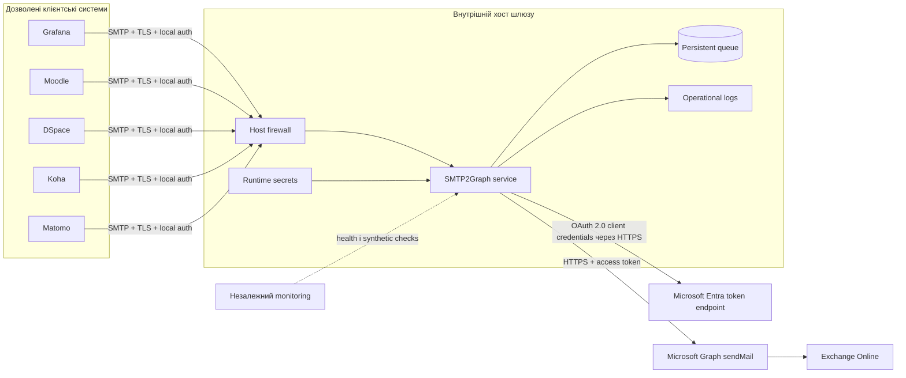
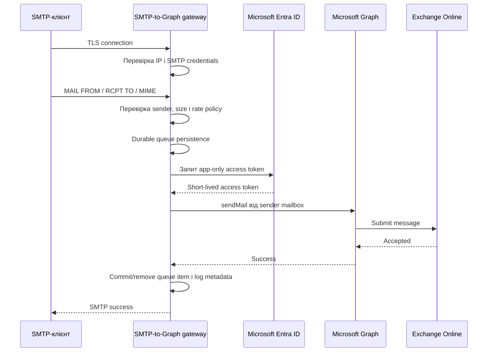
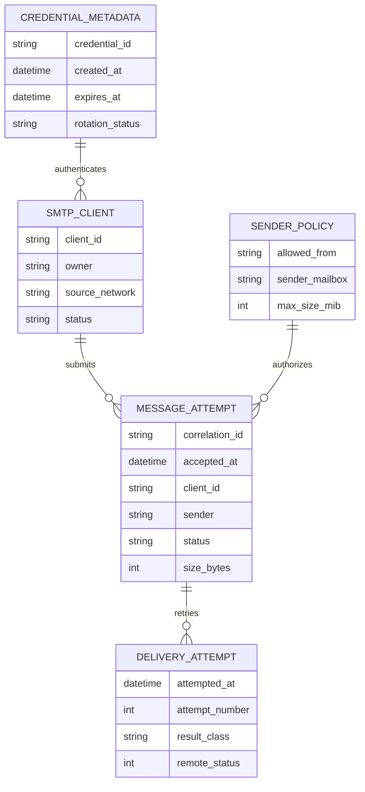

# SMTP-шлюз до Microsoft Graph: специфікація проєкту

**Шлях у репозиторії:** `docs/SPEC.md`  
**Статус:** Чернетка для перегляду  
**Підхід:** Spec-Driven Development  
**Мова:** українська  
**Останнє оновлення:** 2026-07-20

> Документ визначає production-мінімум SMTP-шлюзу для внутрішніх систем, які мають надсилати пошту через Microsoft 365 зі збереженням Microsoft Entra Security Defaults. Це специфікація для планування, а не інструкція з імплементації.

---

# [ВАЛІДАЦІЯ ВХІДНИХ ДАНИХ]

## Оцінка достатності інформації

Наданої інформації достатньо для створення **чернетки специфікації**, визначення меж системи, архітектури, базової моделі безпеки, production-мінімуму та плану валідації. Інформації недостатньо для погодження production-розгортання без вирішення критичних питань нижче.

Підтверджений напрям проєкту:

- Microsoft Entra Security Defaults залишаються увімкненими.
- Наявні системи продовжують використовувати SMTP як клієнтський протокол.
- Шлюз надсилає пошту через Microsoft Graph, а не через Exchange Online SMTP AUTH.
- Початкові клієнти: Grafana, Moodle, DSpace, Koha та Matomo.
- Пріоритетом є безпечний і підтримуваний production-мінімум без надмірно складної платформи.

## Critical Questions

1. **Топологія production-середовища**  
   Чи всі SMTP-клієнти працюють на одному Docker-хості, в одному довіреному VLAN або в кількох мережах/локаціях? Це визначає, чи обов’язковий TLS між клієнтами та шлюзом.  
   **Рішення:** Клієнти Grafana, DSpace, Koha та Matomo працюють на одному Docker-хості в єдиній мережі Docker Swarm. Клієнт Moodle працює на іншій віртуальній машині (ВМ) під управлінням спільного гіпервізора. TLS є обов'язковим для Moodle. Для клієнтів у межах Swarm-мережі TLS є необов'язковим лише за умови використання зашифрованої overlay-мережі Docker Swarm (створеної з прапорцем `--opt encrypted`).

2. **Платформа розгортання**  
   Чи є наявний і операційно підтримуваний Docker Swarm, чи це буде окремий Docker-хост?  
   **Рішення:** Для production-мінімуму обрано single-node Docker Swarm, оскільки він забезпечує використання Docker Secrets.

3. **Поштова скринька відправника**  
   Яка скринька або shared mailbox Exchange Online буде єдиним дозволеним відправником?  
   **Рішення:** На MVP-стадії єдиним дозволеним відправником є `noreply@ldubgd.edu.ua`. На подальших етапах для кожного сервісу буде створено окрему поштову скриньку для відправки. Використання однієї адреси з окремими display name для різних клієнтів несе ризик того, що Exchange Online підставлятиме display name самої скриньки замість імені з заголовка MIME `From`, що вимагає перевірки та тестування на Gate B.

4. **Обмеження доступу Graph-застосунку**  
   Який підтримуваний механізм Exchange Online буде використано для обмеження application permission `Mail.Send` лише службовою скринькою?  
   **Рішення:** Обмеження доступу реалізується через Exchange Online RBAC for Applications.

5. **Сумісність SMTP2Graph із безпечним передаванням секретів**  
   Приклад upstream-конфігурації допускає client secret у `config.yml`, тоді як цільовий baseline вимагає runtime-секрети у `/run/secrets/`.  
   **Рішення:** Створюється тимчасова runtime-конфігурація без постійного зберігання plaintext-секретів на диску. Деплой виконується через GitHub Actions із використанням **SOPS + age** для шифрування статичних файлів середовища у Git (`env.dev.enc`, `env.prod.enc`). Під час деплою секрети розпаковуються безпосередньо у Docker Secrets (`/run/secrets/`). Ansible Vault виключено зі стеку для спрощення CI/CD та уникнення дублювання інструментів. Як шаблони використовуються скрипт оркестрації `scripts/deploy-orchestrator-swarm.sh` та CI/CD pipeline `.github/workflows/main.yml`.

6. **Чутливість повідомлень і вкладення**  
   Чи можуть повідомлення містити персональні, освітні, автентифікаційні або інші чутливі дані, і який максимальний розмір вкладення потрібний?  
   **Рішення:** Повідомлення можуть містити посилання для скидання паролів та обмежені персональні дані. Тіла листів заборонено журналювати або безконтрольно резервувати.

## Important Questions

1. Очікувана звичайна та пікова інтенсивність пошти, особливо Moodle digest і масові сповіщення.  
   **Рішення:** Звичайне навантаження становить менше 10 повідомлень за хвилину. Для захисту від сплесків навантаження (зокрема масових розсилок Moodle) встановлюються жорсткі ліміти: максимум 5 одночасних сесій від одного IP та не більше 30 повідомлень на хвилину для одного клієнта з примусовою затримкою для Moodle.
2. Необхідна доступність і допустимий час відновлення.  
   **Рішення:** RTO становить 60 хвилин. Досягнення active-active HA у першій production-версії не потрібне.
3. Строки зберігання операційних журналів і невдалих повідомлень.  
   **Рішення:** Журнали зберігаються 30 днів, невдалі payload-повідомлення не довше 7 днів.
4. Чи кожен клієнт потребує окремої видимої адреси відправника.  
   **Рішення:** На старті використовується одна адреса з окремими display name для клієнтів.
5. Платформа Git і CI/CD.  
   **Рішення:** Використовується Git-платформа із protected branches, CI, secret scanning та approval для production.
6. Чи використовується інституційний HTTP/HTTPS proxy для вихідного доступу.  
   **Рішення:** Доступний прямий вихід TCP 443 до Microsoft identity platform та Microsoft Graph (проксі не потрібен).
7. Чи прийнятна ліцензія SMTP2Graph GPL-3.0.  
   **Рішення:** Ліцензійні ризики GPL-3.0 для внутрішнього некомерційного використання без розповсюдження коду є низькими, тому це питання вважається закритим і не потребує окремого Gate.
8. Бажана система моніторингу та незалежний канал сповіщень.  
   **Рішення:** За моніторинг та алерти відповідатиме VictoriaMetrics + Grafana, налаштування буде в останній фазі впровадження.

## Optional Questions

- Наявність внутрішньої PKI для SMTP TLS.
- Стандарти іменування Entra-застосунків, секретів, сервісів і DNS.
- Наявність тестового Microsoft 365 tenant або окремої тестової скриньки.
- Потреба в майбутньому self-service onboarding клієнтів.

---

# [КРИТИКА ТА РЕКОМЕНДАЦІЇ]

## Архітектурні ризики

- **Єдина точка відмови:** один шлюз впливає на всі клієнтські системи. Для production-мінімуму це прийнятно лише за наявності persistent queue, restart policy, перевіреного recovery та fallback-процедури.
- **Залежність від стороннього компонента:** SMTP2Graph стає security-sensitive мостом між внутрішнім SMTP та Microsoft Graph. Потрібен аналіз версії, ліцензії, активності підтримки, provenance образу й уразливостей.
- **Невідповідність моделі секретів:** якщо застосунок приймає секрет лише всередині YAML, наївний Docker deployment порушить security baseline.
- **Ризики протокольної межі:** потрібно перевірити envelope sender, header sender, recipients, BCC, HTML, Unicode та attachments.
- **Ризик underengineering:** публічний SMTP-порт, необмежений `From` і tenant-wide `Mail.Send` неприйнятні.
- **Ризик overengineering:** Kubernetes, service mesh, зовнішній broker, database або active-active cluster не виправдані для першої production-версії.

## Продуктові та scope-ризики

- Проєкт не має UI чи звичайних кінцевих користувачів. Це інфраструктурний продукт для адміністраторів і операторів.
- Production minimum означає не лише запуск контейнера, а end-to-end доставлення, контроль доступу, retry, recovery, observability та негативні security-тести.
- Moodle може створювати значно більше навантаження, тому його доцільно підключати після малонавантажених клієнтів і burst test.
- Єдина адреса відправника спрощує експлуатацію, але потребує перевірки `Reply-To` та очікувань користувачів.

## Security-ризики

- Application permission `Mail.Send` має високий вплив без mailbox-level scope.
- Витік client credential дозволить автоматизоване надсилання до моменту відкликання.
- SMTP credentials можуть потрапити в конфігурації, support bundles, debug logs, process inspection або Git.
- IP allowlist недостатній, якщо багато систем виходять через один NAT.
- Plain SMTP через маршрутизовану мережу розкриває credentials і тіла листів.
- Mutable image tags та неперевірені образи створюють supply-chain ризик.
- Debug logs можуть містити recipients, subjects, reset links або заголовки.
- CI не повинен отримувати production secrets, якщо він не є довіреною deployment boundary.

## Data-ризики

- Файли черги можуть містити повні MIME-повідомлення з персональними й автентифікаційними даними.
- Backup live queue може створити неконтрольований архів листів.
- Окрема database не потрібна. Стан складається з config metadata, logs, certificates і queued/failed MIME files.
- Неконтрольований ріст черги може заповнити файлову систему.

## DevOps та operations-ризики

- Перевірка відкритого TCP-порту не доводить працездатність Graph delivery.
- Сповіщення через той самий gateway створює циклічну залежність.
- Downgrade може бути несумісним із queue format новішої версії.
- Production, staging і development не повинні використовувати спільні credentials, mailboxes або allowlists.
- Автоматичне використання `latest` у production неприйнятне.

## Рекомендації

### Обов’язково включити в production minimum

- Один SMTP-to-Graph gateway.
- Одну окрему sender mailbox.
- Microsoft Graph application-only authentication.
- Перевірене обмеження Graph-доступу однією скринькою.
- TLS для SMTP між різними хостами.
- SMTP authentication разом з IP allowlist.
- Точний `From` allowlist і message-size limit.
- Обмежену persistent retry queue.
- Container image, зафіксований digest.
- Docker Secrets або еквівалентний безпечний runtime secret mechanism.
- Non-root execution, якщо це підтримує вибрана версія.
- CI security checks, ручне production approval, rollback і recovery test.
- Незалежний monitoring і synthetic delivery test.

### Відкласти

- Active-active HA.
- Web admin UI.
- Self-service onboarding.
- Окремий Graph-застосунок для кожного клієнта.
- Зовнішню database чи message broker.
- Kubernetes або service mesh.
- Автоматичну rotation secrets, якщо компонент не підтримує її безпечно.
- Окрему sender mailbox для кожної системи, якщо це не обов’язкова вимога.

### Рекомендовані навички для майбутніх ШІ-агентів

1. Microsoft Entra ID App Registration і OAuth 2.0 client credentials.
2. Microsoft Graph `sendMail` та Exchange Online RBAC for Applications.
3. SMTP/MIME, TLS, envelope/header sender, BCC і retry codes.
4. Docker Swarm, Docker Secrets, container hardening і persistent volumes.
5. SOPS + age та rotation secrets.
6. GitSecOps: Gitleaks, dependency review, SBOM, image scanning і signature verification.
7. Lightweight threat modeling, наприклад STRIDE.
8. SRE runbooks, SLO, synthetic monitoring, backup/restore, rollback та incident response.
9. Mermaid і ADR authoring.
10. License і supply-chain review open-source компонентів.

---

# 1. Огляд проєкту

## Назва

**SMTP-шлюз до Microsoft Graph**

## Короткий опис

Централізований SMTP-шлюз приймає пошту від дозволених внутрішніх застосунків і надсилає її через Microsoft Graph від імені application identity. Рішення зберігає Microsoft Entra Security Defaults і не використовує Exchange Online SMTP AUTH, App Password, пароль поштової скриньки або винятки MFA.

SMTP2Graph є початковим кандидатом, оскільки надає SMTP server, relay через Graph, SMTP AUTH, TLS, IP та `From` allowlists, rate limiting, brute-force protection і локальну чергу. Upstream container використовує `/data` для конфігурації, журналів і message queue.

## Бізнесова й операційна ціль

Відновити та стандартизувати надсилання пошти для Grafana, Moodle, DSpace, Koha і Matomo з мінімальними змінами клієнтів, зберігши безпечне, аудитоване та відновлюване production-рішення.

## Цільові користувачі

- Адміністратори Microsoft 365 та Exchange Online.
- Linux, Docker і platform administrators.
- Адміністратори Grafana, Moodle, DSpace, Koha та Matomo.
- Security reviewers та incident responders.

## Основні use cases

- Системні алерти й операційні сповіщення.
- Реєстрація облікових записів і скидання пароля.
- Сповіщення освітніх процесів.
- Повідомлення бібліотечної та репозитарної систем.
- Аналітичні й заплановані звіти.

## Критерії успіху

- Security Defaults залишаються увімкненими.
- Exchange Online SMTP AUTH і mailbox password не використовуються.
- Дозволені застосунки надсилають листи внутрішнім і зовнішнім адресатам.
- Недозволені IP, credentials і `From` відхиляються.
- Graph-застосунок не може надсилати від імені скриньок поза scope.
- Тимчасові помилки Graph не спричиняють тиху втрату повідомлень.
- Оператори можуть виявити збій, провести rotation credentials, відновлення та rollback.

---

# 2. Межі проєкту

## In Scope

- Один production gateway instance.
- SMTP ingestion від Grafana, Moodle, DSpace, Koha та Matomo.
- Application-only OAuth 2.0 до Microsoft Graph.
- Одна dedicated mailbox/shared mailbox як відправник.
- Окремі локальні SMTP credentials для клієнтів, якщо це підтримується.
- Source IP allowlist і строгий sender allowlist.
- TLS для routed SMTP connections.
- Message-size limits, rate limits, retry queue і dead-letter handling.
- Docker deployment із native secrets management.
- Розділення non-production і production identities/configuration.
- CI validation, security scanning, controlled deployment, backup, rollback і recovery.
- Operational logs та independent synthetic monitoring.

## Out of Scope

- Отримання пошти через IMAP/POP.
- Інтерактивні mailbox logins.
- SMTP relay, доступний з інтернету.
- General-purpose MTA.
- Маркетингові та bulk campaigns.
- Active-active clustering.
- Власна розробка gateway, якщо кандидат проходить acceptance tests.
- Довгострокове архівування вмісту повідомлень.
- Web administration interface.

## Future Considerations

- Active-passive standby host.
- Окремі sender mailbox для застосунків.
- Certificate-based Graph credential, якщо не використано відразу.
- Central secret manager або hardware-backed keys.
- Prometheus exporter.
- Automatic client onboarding.
- Заміна шлюзу, якщо підтримка або security posture SMTP2Graph стане неприйнятною.

---

# 3. Продуктові вимоги

## Ролі

- **Platform Operator:** deploy, monitoring, backup, restore та upgrade.
- **Microsoft 365 Administrator:** App Registration, Graph/Exchange authorization і sender mailbox.
- **Application Administrator:** конфігурація окремого SMTP-клієнта.
- **Security Reviewer:** перевірка permissions, secret handling, network exposure і supply chain.
- **Auditor/Incident Responder:** аналіз подій без стандартного доступу до message bodies та secrets.

## User stories

- Як адміністратор застосунку, я можу налаштувати стандартний SMTP endpoint без імплементації OAuth.
- Як Microsoft 365 administrator, я можу обмежити application identity однією sender mailbox.
- Як operator, я можу визначити queued і failed deliveries без зайвого перегляду вмісту листів.
- Як security reviewer, я можу перевірити відсутність production secrets у Git та CI logs.
- Як operator, я можу безпечно виконати rotation Graph credential і SMTP credentials.
- Як incident responder, я можу відкликати Graph credential без зміни Security Defaults.

## Основні workflows

1. **Onboarding клієнта:** створити credential, дозволити source IP, sender, тест і owner record.
2. **Надсилання:** автентифікувати клієнта, перевірити policy, зберегти в queue, отримати token, надіслати, записати результат.
3. **Тимчасова помилка:** зберегти повідомлення, retry із bounded backoff, alert за threshold.
4. **Постійна помилка:** припинити retries, перенести у failed state, сповістити operator.
5. **Rotation credential:** додати новий credential, перевірити, перемкнути, відкликати старий.
6. **Upgrade:** перевірити pinned candidate у non-production, backup state, deploy, verify, retain rollback artifact.

## Функціональні вимоги

- **FR-001:** приймати SMTP лише на визначеному internal interface і port.
- **FR-002:** вимагати TLS для connections між різними хостами.
- **FR-003:** використовувати унікальні client credentials, де підтримується.
- **FR-004:** дозволяти лише configured source IP/subnets.
- **FR-005:** дозволяти лише dedicated sender у SMTP envelope і message headers.
- **FR-006:** максимальний розмір повідомлення 25 MiB.
- **FR-007:** надсилати через Graph з application-only OAuth 2.0.
- **FR-008:** підтримувати To, CC, BCC, Reply-To, HTML, Unicode та attachments.
- **FR-009:** повторювати transient failures і припиняти retry permanent failures.
- **FR-010:** зберігати queue після restart контейнера.
- **FR-011:** формувати structured logs без секретів і message bodies.
- **FR-012:** надавати health signal і можливість synthetic delivery test.
- **FR-013:** застосовувати rate і connection limits.
- **FR-014:** відхиляти unauthorized clients/senders до Graph submission.

## Нефункціональні вимоги

- **Безпека:** least privilege, відсутність plaintext secrets у Git, відсутність public SMTP exposure.
- **Доступність:** 99,5% на місяць.
- **Recovery:** RTO 60 хвилин (підтверджено); configuration RPO 24 години.
- **Продуктивність:** витримувати очікуваний burst без втрати повідомлень.
- **Підтримуваність:** один deployable service, pinned dependencies, documented operations.
- **Аудитованість:** security events прив’язані до клієнта й часу.
- **Приватність:** message body, attachments, OAuth tokens і SMTP passwords не журналюються.

## Acceptance criteria production minimum

1. Усі п’ять типів клієнтів проходять controlled test, навіть якщо production onboarding поетапний.
2. Тестові повідомлення доставляються внутрішнім і зовнішнім адресатам.
3. HTML, український текст, Unicode subject, CC, BCC, Reply-To та вкладення зберігаються коректно.
4. Invalid credential, unauthorized IP, sender і oversize message відхиляються.
5. Graph identity не може надсилати від імені mailbox поза scope.
6. Симульований Graph outage ставить лист у queue та доставляє після відновлення.
7. Permanent errors не повторюються нескінченно.
8. Restart контейнера не втрачає queued messages.
9. Secrets відсутні в Git history, CI output, image metadata та `docker inspect` environment.
10. Завершені SBOM, vulnerability scan, backup, restore, rollback і runbook review.
11. Збій gateway створює alert через незалежний канал.

---

# 4. Огляд архітектури

## High-level architecture



## Основні компоненти

### Клієнтські застосунки

- Генерують повідомлення.
- Автентифікуються на внутрішньому SMTP gateway.
- Використовують дозволені sender і Reply-To.
- Обробляють SMTP rejection та зберігають application-level evidence.

### SMTP2Graph gateway

- Завершує SMTP/TLS.
- Перевіряє client, network, sender, size та rate policies.
- Передає MIME content до Microsoft Graph.
- Підтримує bounded retry queue.
- Формує operational logs і health state.

### Microsoft Entra application identity

- Отримує app-only access tokens.
- Не має interactive user, MFA registration, mailbox password або refresh token.
- Обмежена approved sender mailbox через Exchange authorization.

### Microsoft Graph та Exchange Online

- Приймають authenticated `sendMail` requests.
- Застосовують Exchange transport, anti-spam, DKIM/DMARC і delivery policies.

### Операційні системи

- CI/CD перевіряє і deploy-ить immutable artifacts.
- Monitoring контролює process health, queue, expiry та synthetic delivery.
- Backup захищає configuration та recovery material, але не створює mail archive.

## Критичний flow



**[УВАГА]:** потрібно перевірити момент SMTP acknowledgement. Якщо gateway повертає success до durable queue persistence або Graph acceptance, failure semantics мають бути задокументовані й погоджені.

## Failure flow

- Authentication/policy failure: негайне відхилення без queue.
- Graph 401/403: configuration/security failure, alert, без нескінченних retries.
- Graph 429/5xx/network timeout: bounded retry with backoff.
- Queue threshold: alert до exhaustion; reject, якщо durable acceptance неможливий.
- Expired credential/certificate: alert до expiry та fail closed.

---

# 5. Архітектурні варіанти

## Варіант A: SMTP2Graph у single-node Docker Swarm

**Опис:** один Swarm service, persistent storage, Docker Secrets, pinned image digest.

**Переваги:** native encrypted secret distribution, мінімальна кількість компонентів, простий rollback, відсутність database/broker.

**Недоліки:** один host залишається failure domain; stateful queue потребує node constraint; потрібна перевірка secret-file compatibility.

**Складність:** Low to Medium.

**Security impact:** добрий за умови mailbox scope, non-root, network restrictions і runtime secrets.

**Operational impact:** потрібні базові знання Swarm, backup і recovery.

**Рекомендація:** **основний production-minimum варіант**, якщо вирішено Critical Question 5.

## Варіант B: Standalone Docker Compose з host-managed secrets

**Опис:** один контейнер, root-only config/secret files і зовнішній deployment process.

**Переваги:** найпростіший deployment.

**Недоліки:** немає encrypted secret store Swarm; secrets можуть зберігатися на диску; rotation залежить від host discipline.

**Складність:** Low.

**Security impact:** прийнятний лише з encrypted host storage, strict permissions та відсутністю secrets в environment.

**Operational impact:** простий runtime, слабший secret lifecycle.

**Рекомендація:** fallback, якщо Swarm не підтримується.

## Варіант C: Власний SMTP-to-Graph gateway

**Опис:** розробка typed internal service.

**Переваги:** точний контроль API, secrets, telemetry і policies.

**Недоліки:** MIME, BCC, attachments, SMTP state, retry semantics і Graph throttling стають внутрішньою відповідальністю.

**Складність:** High.

**Security impact:** потенційно високий після стабілізації, але значний початковий defect risk.

**Operational impact:** потрібна постійна software ownership.

**Рекомендація:** не використовувати для production minimum. Повернутися лише якщо SMTP2Graph не проходить acceptance tests.

## Варіант D: SMTP relay через Exchange Online connector і static IP

**Опис:** relay через connector, який довіряє статичній публічній IP.

**Переваги:** немає Graph app і gateway software.

**Недоліки:** залежність від static IP, port 25 і network topology; варіант раніше відхилений як цільовий.

**Складність:** Low.

**Security impact:** добрий за strict scope, але identity заснована на мережі.

**Operational impact:** мінімальна кількість компонентів.

**Рекомендація:** contingency/fallback, не target architecture.

---

# 6. Модель даних і зберігання

## Storage model

Relational database не потрібна. Gateway є stateful edge service з file-backed operational state.

## Логічні сутності



Це концептуальна модель для logs, runbooks та observability, а не вимога database schema.

## Filesystem state

- `/data/queue`: тимчасові queued MIME payloads.
- `/data/failed`: failed/dead-letter payloads із restricted access.
- `/data/logs`: operational metadata logs.
- `/data/config`: non-secret configuration, якщо потрібно.
- `/run/secrets`: runtime-only secrets у Swarm.

## Constraints

- Директорія `/data/queue` доступна лише service identity та operator/root. Директорія `/data/failed` повинна мати права доступу POSIX `0700` (доступ лише для UID контейнера шлюзу/оператора).
- Автоматична ротація (через cron job або внутрішній worker) жорстко видаляє невдалі повідомлення (payloads) з `/data/failed` після закінчення терміну зберігання (7 днів).
- Correlation IDs мають бути унікальними для operational tracing.
- Queue disk allocation: 1 GiB.
- Alerts на 60% і 80%; safe rejection до exhaustion.
- Message bodies і attachments не копіюються в загальні logs.

## Retention

- Successful queue item: видаляється після confirmed acceptance.
- Failed payload: не більше 7 днів (підтверджено).
- Operational logs: 30 днів (підтверджено).
- Security/audit metadata: 30 днів.

## Backup relevance

Резервувати:

- declarative non-secret configuration;
- encrypted secret source або recovery escrow;
- TLS public certificates і захищений recovery material для private key;
- deployment manifests;
- failed-message evidence лише за operational need і в зашифрованому вигляді. Включення каталогу `/data/failed` у планові резервні копії (backups) суворо заборонено для уникнення витоку чутливих даних у довгострокові архіви.

Live queue не є mail archive. Restore може спричинити duplicate delivery, тому процедура має враховувати replay risk.

---

# 7. API-контракти

## Основний зовнішній контракт: SMTP ingress

Production gateway надає SMTP, а не custom HTTP API.

### Connection contract

- Protocol: SMTP із STARTTLS або implicit TLS після compatibility test.
- Interface: лише internal address.
- Запропонований port: `2525`.
- Authentication: SMTP AUTH `PLAIN` або `LOGIN` лише всередині TLS.
- Authorization: source IP/subnet, client credential, sender allowlist, size/rate policy.

### Обов’язкова поведінка SMTP

- Підтримувати envelope sender і recipients.
- Підтримувати To, CC, BCC, Reply-To, MIME multipart, HTML, UTF-8 і attachments.
- Повертати 4xx для retryable temporary failures.
- Повертати 5xx для auth, authorization, policy, format або size failures.
- Не повертати success до досягнення задокументованої durability boundary.

### Error model

- `4xx`: retryable після тимчасової помилки.
- `5xx`: non-retryable без зміни message/configuration.
- Internal logs пов’язують SMTP response з correlation ID.
- Raw Graph errors і tokens не передаються клієнтам.

## Outbound contract: Microsoft Graph

- Authentication: OAuth 2.0 client credentials.
- Permission: application mail sending, restricted to approved mailbox.
- Transport: HTTPS/TCP 443.
- Retry classes: 429, вибрані 5xx і network failures.
- Non-retry classes: invalid client, unauthorized mailbox, denied permission, malformed request.

## Administrative API

Не входить у scope. Configuration changes проходять через reviewed repository changes та controlled deployment.

---

# 8. Базова модель безпеки

## Authentication model

- Applications використовують окремі local SMTP credentials.
- Gateway використовує application-only client credentials до Microsoft Entra.
- Human operators використовують наявні host, Git, Microsoft 365 і CI controls.

## Authorization model

- Network authorization: IP/subnet allowlist.
- Client authorization: unique SMTP credential.
- Sender authorization: exact sender allowlist.
- Microsoft 365 authorization: application identity restricted to one mailbox.
- Operator authorization: least-privilege host і deployment roles.

## Secrets management

### Preferred production baseline

- Single-node Docker Swarm.
- Docker Secrets mounted у `/run/secrets/`.
- Жодних production secrets у `.env`, stack YAML, Git, image layers, build args, CI artifacts або logs.
- SOPS + age використовується для шифрування статичних файлів середовища у Git. Дешифрування та передача в Docker Secrets відбуваються в CI/CD.
- Age private identity не зберігається в тому самому repository та не доступна untrusted CI.
- Rotation використовує versioned secret names, оскільки Docker Secrets є immutable. Оновлення секретів потребує оновлення сервісу Docker Swarm (service update / redeploy), що викликає короткочасний перезапуск контейнера. Цей запланований перезапуск повністю вкладається в рамки SLA 99.5% доступності (допускає ~3.6 годин простою на місяць).

### Пріоритет credentials

1. Graph certificate/private key через file path, якщо це підтримує pinned SMTP2Graph release.
2. Graph client secret як runtime secret, якщо certificate path несумісний або затримує production.

## Environment separation

- Окремі App Registration, credentials, sender mailbox, SMTP credentials, DNS/port і allowlists для non-production та production.
- Production messages не replay-яться у non-production.
- Non-production recipients бажано обмежити test allowlist.

## Container security

- Pinned image digest.
- Non-root, якщо підтримується.
- Drop unnecessary Linux capabilities.
- `no-new-privileges`.
- Read-only root filesystem, якщо сумісний.
- Writable access лише до queue/log paths.
- CPU, memory, PID і disk limits.
- Без Docker socket mount.
- Без privileged mode та host networking.
- Port binding лише на internal address.
- Host firewall як другий рівень контролю.

## Dependency та supply-chain security

- Перевірка maintenance cadence, vulnerabilities, license, provenance і dependency lockfile.
- Digest pinning після scan.
- SBOM generation або retrieval.
- Image scan для кожного upgrade.
- Signature verification, якщо upstream підтримує signed images.
- Rebuild from source лише за policy requirement.

## Audit logging

Журналювати:

- timestamp;
- source IP;
- client identifier;
- correlation/message ID;
- normalized sender;
- recipient count або domains відповідно до privacy policy;
- message size;
- policy decision;
- delivery result class;
- retry count і duration.

Не журналювати:

- SMTP passwords;
- Graph secret/private key;
- access token або Authorization headers;
- message body;
- attachments;
- password-reset URL або sensitive headers.

## Threat-focused controls

- **Open relay:** deny by default, internal binding, IP allowlist, SMTP auth, sender allowlist.
- **Mailbox impersonation:** exact sender allowlist і Exchange application scope.
- **Credential theft:** runtime secrets, rotation і revocation runbook.
- **Queue disclosure:** strict permissions, encrypted host storage, short retention.
- **Resource exhaustion:** size, rate, connection, PID, memory і disk limits.
- **Supply-chain compromise:** digest pinning, scans, SBOM, controlled upgrade.
- **Replay/duplicates:** documented queue semantics і restore safeguards.

---

# 9. GitSecOps Baseline

## Структура репозиторію

```text
.
├── README.md
├── docs/
│   ├── SPEC.md
│   ├── ROADMAP.md
│   ├── AI_CONTEXT.md
│   ├── RUNBOOK.md
│   ├── scripts_runbook.md
│   └── adr/
├── deploy/
│   ├── swarm/
│   ├── config/
│   └── monitoring/
├── tests/
│   ├── smoke/
│   ├── security/
│   └── acceptance/
├── scripts/
├── .github/ або equivalent-ci/
├── .sops.yaml
├── .env.example
└── SECURITY.md
```

На цьому етапі структура не передбачає генерації implementation code.

## Branch та merge strategy

- Trunk-based або short-lived feature branches.
- Protected default branch.
- Pull request обов’язковий.
- Мінімум один technical review; security-sensitive changes потребують security/owner review.
- CODEOWNERS для deployment, security та Microsoft 365 paths.
- Signed commits/tags бажані.
- Заборонений direct production deploy з unreviewed branch.

## CI assumptions

Required checks:

- Markdown і YAML linting.
- Schema validation gateway configuration.
- Secret scanning, включно з history при першому запуску.
- Dependency і license review.
- Container image vulnerability scan.
- SBOM.
- Policy checks для unpinned images, privileged mode, public ports, plaintext secrets і missing resource limits.
- Mermaid validation, якщо підтримується.

## Secret scanning

- Pre-commit і CI secret scanning.
- Blocking known credential patterns і high-entropy secrets.
- Виявлений credential вважається compromised і підлягає rotation.
- Видалення одного файла без rotation не вважається remediation.

## Deployment safety

- CI створює reviewed candidate, але не виконує unapproved production change.
- Production deploy потребує protected environment approval.
- Immutable image digest і versioned secrets/configs.
- Pre-deploy backup і health checks.
- Post-deploy smoke та synthetic tests.
- Automatic rollback лише за відомої queue compatibility.
- CI logs мають redaction і не використовують shell tracing для secret handling.

---

# 10. План документації

## `docs/SPEC.md`

- **Призначення:** джерело істини для scope, requirements, architecture, security та acceptance.
- **Створити:** зараз.
- **Оновлювати:** при погоджених змінах вимог або меж архітектури.

## `docs/ROADMAP.md`

- **Призначення:** поетапний implementation plan із dependencies, owners, gates і rollback points.
- **Створити:** після вирішення Critical Questions і review SPEC.
- **Оновлювати:** після кожного milestone або scope change.

## `docs/AI_CONTEXT.md`

- **Призначення:** стислий англомовний контекст для майбутніх AI agents.
- **Створити:** після approval SPEC та перших ADR.
- **Оновлювати:** після ADR, milestones або stack changes.

## `docs/RUNBOOK.md`

- **Призначення:** deploy, operate, monitor, rotate, recover, rollback та incident response.
- **Створити:** до staging deployment.
- **Оновлювати:** після operational changes або incidents.

## `docs/scripts_runbook.md`

- **Призначення:** purpose, inputs, outputs, permissions, dry-run і rollback для scripts.
- **Створити:** з першим Entra/Exchange/deployment script.
- **Оновлювати:** при зміні поведінки scripts.

## `docs/SECURITY_MODEL.md`

- **Призначення:** формальна модель загроз (наприклад, за STRIDE) та винятки (exceptions). Для уникнення дублювання та розбіжностей, SPEC.md містить виключно baseline-контролі безпеки, тоді як SECURITY_MODEL.md фокусується на формальному аналізі загроз і винятках.
- **Створити:** до production, якщо SPEC недостатньо, або під час post-MVP hardening.
- **Оновлювати:** після threat review, incident або authorization changes.

## `docs/adr/`

- **Призначення:** довготривале документування важливих рішень.
- **Створити:** до costly implementation decisions.
- **Оновлювати:** accepted ADR не переписується, а supersede-иться новим.

## `README.md`

- **Призначення:** entry point, status, prerequisites, document map і safe validation.
- **Створити:** разом із repository.
- **Оновлювати:** при зміні onboarding або document locations.

## `.env.example`

- **Призначення:** лише non-secret variable names і safe examples.
- **Створити:** тільки якщо local tooling потребує env vars.
- **Оновлювати:** при зміні configuration keys.

## Додатково необхідні документи

- `SECURITY.md`: vulnerability reporting, supported versions і secret-leak response.
- `docs/TEST_PLAN.md`: acceptance, failure injection, security та recovery tests, до staging.
- `docs/CLIENT_ONBOARDING.md`: checklist підключення застосунків, до другого клієнта.

Окремий `docs/PRD.md` зараз не рекомендований. Product requirements у SPEC достатні для інфраструктурного gateway без UI.

---

# 11. Вимоги до ADR

Формат:

```text
docs/adr/ADR-0001-title.md
```

Кожен ADR містить:

- Status: Proposed / Accepted / Rejected / Superseded;
- Context;
- Decision;
- Alternatives Considered;
- Consequences.

Початкові ADR:

1. `ADR-0001-use-smtp-to-graph-not-smtp-auth.md`
2. `ADR-0002-select-smtp2graph-as-initial-gateway.md`
3. `ADR-0003-select-single-node-swarm-for-production-minimum.md`
4. `ADR-0004-use-dedicated-single-sender-mailbox.md`
5. `ADR-0005-restrict-graph-mail-send-to-sender-mailbox.md`
6. `ADR-0006-runtime-secrets-and-sops-age-policy.md`
7. `ADR-0007-single-instance-with-cold-recovery.md`

ADR не створюються для легко зворотних параметрів із низьким впливом.

---

# 12. Документ контексту для ШІ

Запланувати `docs/AI_CONTEXT.md` англійською мовою:

```markdown
# AI_CONTEXT.md

## Project Summary
## Current Status
## Key Decisions
## Architecture Snapshot
## Tech Stack
## Security Constraints
## Repository Structure
## Important Documents
## Implementation Rules for AI Agents
## Known Assumptions
## Open Questions
## Last Updated
```

Правила:

- Не включати secrets, tokens, private keys, SMTP passwords або sensitive message samples.
- Не дублювати SPEC, ROADMAP, RUNBOOK чи ADR.
- Посилатися на source documents.
- У разі конфлікту source documents мають пріоритет.
- Додати pinned gateway version/digest після вибору.
- Явно заборонити: disable Security Defaults, enable Exchange SMTP AUTH, expose SMTP publicly, зберігати secrets у `.env`/Git, використовувати mutable tags.
- Оновлювати після accepted ADR або completed milestone.

---

# 13. Production-Minimum Deployment Baseline

- Runtime: один Linux host.
- Orchestration: single-node Docker Swarm.
- Services: один SMTP2Graph service.
- Replicas: одна, constrained до node з persistent queue.
- Image: exact version та digest після scan і acceptance test.
- Secrets: Docker Secrets у `/run/secrets/`.
- Encrypted Git material: SOPS + age лише за approval.
- Graph credential: certificate/private key preferred; client secret допускається як documented production-minimum compromise.
- SMTP ingress: internal address, TLS між хостами, unique client credentials, source allowlist.
- Graph egress: HTTPS/TCP 443.
- State: bounded persistent queue та restricted logs.
- Initial resources: 0.5 CPU і 256 MiB RAM, з подальшим tuning.
- Availability: single instance із tested recovery, без active-active.
- Monitoring: process, queue, disk, expiry, failure rate та independent synthetic delivery.

---

# 14. Відкриті рішення та Approval Gates

## Gate A: погодження SPEC [ПРОЙДЕНО]

Отримано відповіді на Critical Questions 1–6 та погоджено загальні межі проєкту.

## Gate B: погодження компонента

Потрібні:

- pinned release;
- proof secret-file compatibility (перевірка автентифікації за сертифікатами cert-based vs client secret support у SMTP2Graph);
- entrypoint-скрипт (wrapper), який динамічно зчитує секрети з `/run/secrets/` та генерує підсумковий `config.yml` у `tmpfs` або тимчасовій теці без збереження на постійний диск;
- перевірка налаштування зашифрованої overlay-мережі Docker Swarm (з `--opt encrypted`);
- окремий acceptance test на display-name behavior (перевірка підміни display name сервером Exchange Online при надсиланні від імені однієї скриньки);
- non-root/read-only compatibility;
- MIME/BCC/attachments tests;
- queue durability та acknowledgement semantics (асинхронний Store-and-Forward);
- supply-chain evidence для exact image digest: Trivy image scan із Formal Exception Record для будь-якого дозволеного Critical/High finding, CycloneDX SBOM через Syft і OCI labels для source/release metadata tracking.

## Gate C: погодження Microsoft 365 authorization

Потрібні:

- dedicated sender mailbox;
- App Registration naming і ownership;
- application-only authorization;
- proof allowed mailbox success;
- proof out-of-scope mailbox denial;
- credential expiry та revocation procedure.

## Gate D: Production readiness

Потрібні acceptance criteria, runbook, backup/restore test, rollback test, monitoring, client owner sign-off і security review.

---
